# SpringBoot-2.x：使用Swagger2构建API文档

## 一、应用背景

随着前后端分离架构和微服务架构的流行，我们使用Spring Boot来构建RESTful API项目的场景越来越多。通常我们的一个RESTful API就有可能要服务于多个不同的开发人员或开发团队：IOS开发、Android开发、Web开发甚至其他的后端服务等。为了减少与其他团队平时开发期间的频繁沟通成本，传统做法就是创建一份RESTful API文档来记录所有接口细节，然而这样的做法有以下几个问题：

- 由于接口众多，并且细节复杂（需要考虑不同的HTTP请求类型、HTTP头部信息、HTTP请求内容等），高质量地创建这份文档本身就是件非常吃力的事，下游的抱怨声不绝于耳。
- 随着时间推移，不断修改接口实现的时候都必须同步修改接口文档，而文档与代码又处于两个不同的媒介，除非有严格的管理机制，不然很容易导致不一致现象。

为了解决上面这样的问题，本文将介绍RESTful API的重磅好伙伴Swagger2，它可以轻松的整合到Spring Boot中，并与Spring MVC程序配合组织出强大RESTful API文档。它既可以减少我们创建文档的工作量，同时说明内容又整合入实现代码中，让维护文档和修改代码整合为一体，可以让我们在修改代码逻辑的同时方便的修改文档说明。另外Swagger2也提供了强大的页面测试功能来调试每个RESTful API

## 二、整合Swagger2

下面，我们以上面仓库中的`springboot-yolo-3-1`工程进行整合改造。

### 添加依赖

```xml
        <!-- 引入swagger相关的jar -->
        <dependency>
            <groupId>io.springfox</groupId>
            <artifactId>springfox-swagger2</artifactId>
            <version>2.9.2</version>
        </dependency>

        <dependency>
            <groupId>io.springfox</groupId>
            <artifactId>springfox-swagger-ui</artifactId>
            <version>2.9.2</version>
        </dependency>
		<dependency>
            <groupId>com.github.xiaoymin</groupId>
            <artifactId>swagger-bootstrap-ui</artifactId>
            <version>1.9.6</version>
        </dependency>
```

### 配置类

```java
@Configuration
@EnableSwagger2
public class SwaggerConfig {
    @Bean
    public Docket createRestApi(){
        return new Docket(DocumentationType.SWAGGER_2)
                .pathMapping("/")
                .select()
                .apis(RequestHandlerSelectors.basePackage("com.yolo.springbootyolo31"))////为当前包路径
                .paths(PathSelectors.any())
                .build().apiInfo(new ApiInfoBuilder()
                        .title("SpringBoot整合Swagger")
                        .description("详细信息")
                        .version("1.0")
                        .contact(new Contact(
                                "Yolo",
                                "https://blog.csdn.net/weixin_43296313?type=blog",
                                "2936412130@qq.com"))
                        .license("The Apache License")
                        .licenseUrl("https://github.com/Yolo229/springboot_learning")
                        .build()
                );
    }
}
```

### 添加文档内容

```java
@Api(tags = "用户管理")
@RestController
@RequestMapping(value = "/users",produces = "application/json; charset=utf-8")     // 通过这里配置使下面的映射都在/users下
public class UserController {

    // 创建线程安全的Map，模拟users信息的存储
    static Map<Long, User> users = Collections.synchronizedMap(new HashMap<Long, User>());

    /**
     * 处理"/users/"的GET请求，用来获取用户列表
     *
     * @return
     */
    @GetMapping("/")
    @ApiOperation(value = "获取用户列表")
    public List<User> getUserList() {
        // 还可以通过@RequestParam从页面中传递参数来进行查询条件或者翻页信息的传递
        List<User> r = new ArrayList<User>(users.values());
        return r;
    }

    /**
     * 处理"/users/"的POST请求，用来创建User
     *
     * @param user
     * @return
     */
    @PostMapping("/")
    @ApiOperation(value = "创建用户", notes = "根据User对象创建用户")
    public String postUser(@RequestBody User user) {
        // @RequestBody注解用来绑定通过http请求中application/json类型上传的数据
        users.put(user.getId(), user);
        return "success";
    }

    /**
     * 处理"/users/{id}"的GET请求，用来获取url中id值的User信息
     *
     * @param id
     * @return
     */
    @GetMapping("/{id}")
    @ApiOperation(value = "获取用户详细信息", notes = "根据url的id来获取用户详细信息")
    public User getUser(@PathVariable Long id) {
        // url中的id可通过@PathVariable绑定到函数的参数中
        return users.get(id);
    }

    /**
     * 处理"/users/{id}"的PUT请求，用来更新User信息
     *
     * @param id
     * @param user
     * @return
     */
    @PutMapping("/{id}")
    @ApiImplicitParam(paramType = "path", dataType = "Long", name = "id", value = "用户编号", required = true, example = "1")
    @ApiOperation(value = "更新用户详细信息", notes = "根据url的id来指定更新对象，并根据传过来的user信息来更新用户详细信息")
    public String putUser(@PathVariable Long id, @RequestBody User user) {
        User u = users.get(id);
        u.setName(user.getName());
        u.setAge(user.getAge());
        users.put(id, u);
        return "success";
    }

    /**
     * 处理"/users/{id}"的DELETE请求，用来删除User
     *
     * @param id
     * @return
     */
    @DeleteMapping("/{id}")
    @ApiOperation(value = "删除用户", notes = "根据url的id来指定删除对象")
    public String deleteUser(@PathVariable Long id) {
        users.remove(id);
        return "success";
    }
    
@Data
@AllArgsConstructor
@NoArgsConstructor
@ApiModel(description="用户实体")
public class User {

    @ApiModelProperty("用户编号")
    private Long id;
    @ApiModelProperty("用户姓名")
    private String name;
    @ApiModelProperty("用户年龄")
    private Integer age;

}    
```

### 测试

完成上述代码添加后，启动Spring Boot程序，访问：`http://localhost:8080/swagger-ui.html`，就能看到下面这样带中文说明的文档了（其中标出了各个注解与文档元素的对应关系以供参考）：

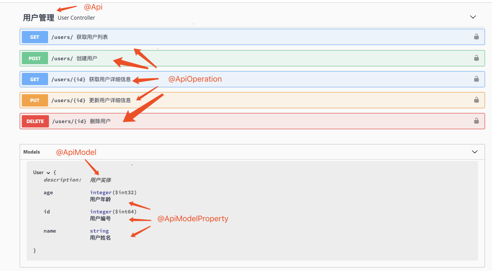

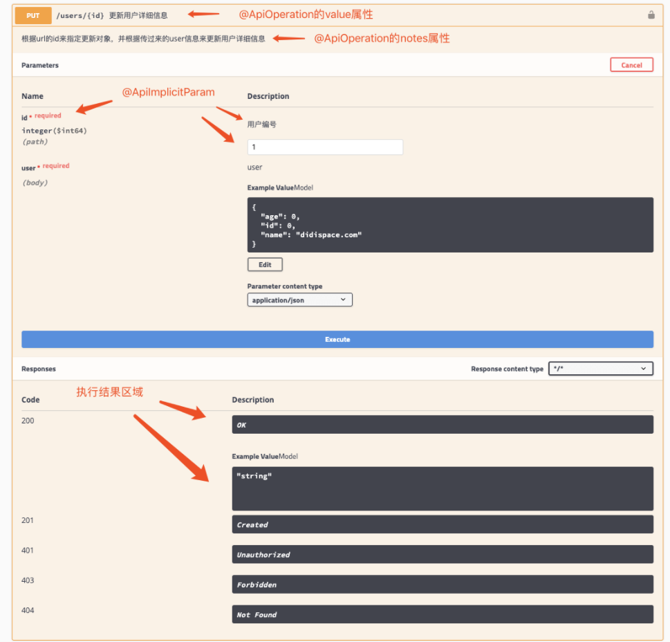

swagger-bootstrap-ui 是 Swagger 的增强UI 实现，目的是替换 Swagger 默认的 UI 实现 Swagger-UI，使文档更友好一点儿

访问地址：`http://127.0.0.1:8080/doc.html`

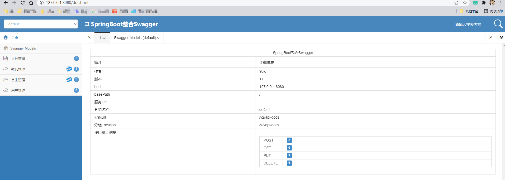

## 三、接口分类

我们在Spring Boot中定义各个接口是以`Controller`作为第一级维度来进行组织的，`Controller`与具体接口之间的关系是一对多的关系。我们可以将同属一个模块的接口定义在一个`Controller`里。默认情况下，Swagger是以`Controller`为单位，对接口进行分组管理的。这个分组的元素在Swagger中称为`Tag`，但是这里的`Tag`与接口的关系并不是一对多的，它支持更丰富的多对多关系

### 默认分组

首先，我们通过一个简单的例子，来看一下默认情况，Swagger是如何根据Controller来组织Tag与接口关系的。定义两个`Controller`，分别负责教师管理与学生管理接口，比如下面这样：

```java
@RestController
@RequestMapping(value = "/student")
public class StudentController {

    @ApiOperation("获取学生清单")
    @GetMapping("/list")
    public String bbb() {
        return "bbb";
    }

    @ApiOperation("获取教某个学生的老师清单")
    @GetMapping("/his-teachers")
    public String ccc() {
        return "ccc";
    }

    @ApiOperation("创建一个学生")
    @PostMapping("/aaa")
    public String aaa() {
        return "aaa";
    }

}

@RestController
@RequestMapping(value = "/teacher")
public class TeacherController {

    @GetMapping("/xxx")
    public String xxx() {
        return "xxx";
    }

}
```

项目启动后，访问地址：`http://localhost:8080/swagger-ui.html#/`可以看到，默认生成了tar名称

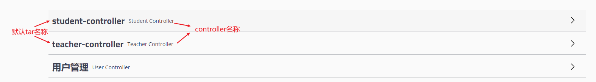

### 自定义默认分组的名称

通过`@Api`注解来自定义`Tag`

```java
@Api(tags = "学生管理")
@RestController
@RequestMapping(value = "/student")
public class StudentController {
	......
}

@Api(tags = "教师管理")
@RestController
@RequestMapping(value = "/teacher")
public class TeacherController {
	......
}
```

再次启动可以看到，自定义的tar代替了默认值

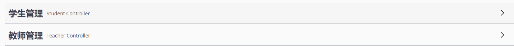

### 合并Controller分组

我们可以发现注解`@Api()`中的`tags`属性其实是一个数组类型。我们可以通过定义同名的`Tag`来汇总`controller`接口。比如我们可以定义一个`Tag`为“教学管理”，让这个分组同时包含教师管理和学生管理的所有接口，可以这样来实现：

```java
@Api(tags = {"教师管理", "教学管理"})
@RestController
@RequestMapping(value = "/teacher")
public class TeacherController {
    // ...
}

@Api(tags = {"学生管理", "教学管理"})
@RestController
@RequestMapping(value = "/student")
public class StudentController {
    // ...
}
```

由下图可以发现，学生管理的接口和教师管理的接口都在教学管理下了

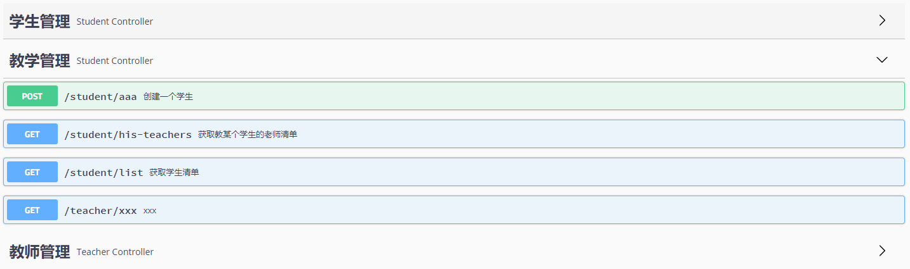

### 更细粒度的接口分组

需求：“教学管理”包含“教师管理”中所有接口以及“学生管理”管理中的“获取学生清单”接口（不是全部接口）

实现：我们可以通过使用`@ApiOperation`注解中的`tags`属性做更细粒度的接口分类定义

```java
@Api(tags = {"教师管理","教学管理"})
@RestController
@RequestMapping(value = "/teacher")
public class TeacherController {

    @ApiOperation(value = "xxx")
    @GetMapping("/xxx")
    public String xxx() {
        return "xxx";
    }

}

@Api(tags = {"学生管理"})
@RestController
@RequestMapping(value = "/student")
public class StudentController {

    @ApiOperation(value = "获取学生清单", tags = "教学管理")
    @GetMapping("/list")
    public String bbb() {
        return "bbb";
    }

    @ApiOperation("获取教某个学生的老师清单")
    @GetMapping("/his-teachers")
    public String ccc() {
        return "ccc";
    }

    @ApiOperation("创建一个学生")
    @PostMapping("/aaa")
    public String aaa() {
        return "aaa";
    }

}
```

由下图可以知道，符合上面需求

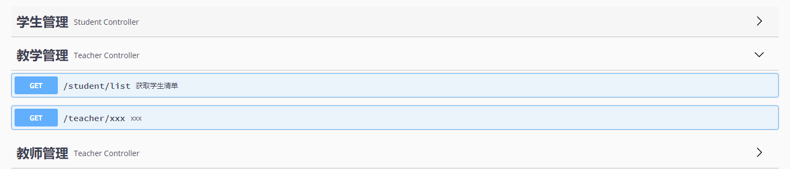

## 四、内容排序

### 分组的排序

我们查看源码可以知道，wagger只提供了一个选项，就是按字母顺序排列。这里我们有一个不需要扩展源码便可以实现的方法：给Tag的命名做编号，比如：

```java
@Api(tags = {"1-教师管理","3-教学管理"})
@RestController
@RequestMapping(value = "/teacher")
public class TeacherController {
    // ...
}

@Api(tags = {"2-学生管理"})
@RestController
@RequestMapping(value = "/student")
public class StudentController {

    @ApiOperation(value = "获取学生清单", tags = "3-教学管理")
    @GetMapping("/list")
    public String bbb() {
        return "bbb";
    }
    // ...
}
```

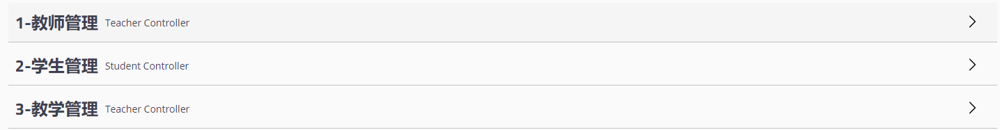

### 接口的排序

第一步：开启增强

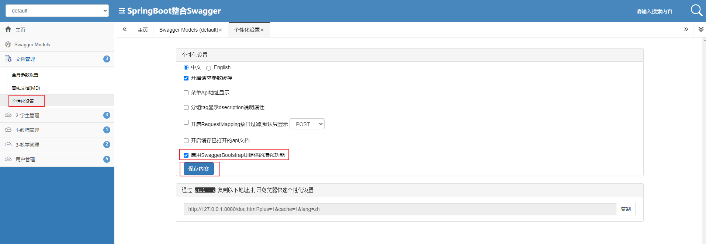

第二步：修改配置类，添加注解`@EnableSwaggerBootstrapUI`

```java
@Configuration
@EnableSwagger2
@EnableSwaggerBootstrapUI
public class SwaggerConfig {
   //...
}
```

第三步：使用注解`@ApiOperationSupport()`

```java
@Api(tags = {"2-学生管理"})
@RestController
@RequestMapping(value = "/student")
public class StudentController {

    @ApiOperation(value = "获取学生清单",tags = "3-教学管理")
    @ApiOperationSupport(order = 1)
    @GetMapping("/list")
    public String bbb() {
        return "bbb";
    }

    @ApiOperation("获取教某个学生的老师清单")
    @ApiOperationSupport(order = 2)
    @GetMapping("/his-teachers")
    public String ccc() {
        return "ccc";
    }

    @ApiOperation("创建一个学生")
    @ApiOperationSupport(order = 3)
    @PostMapping("/aaa")
    public String aaa() {
        return "aaa";
    }

}
```

第四步：查看排序结果

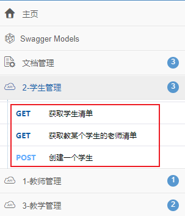

### 参数的排序

默认情况下，Swagger对Model参数内容的展现也是按字母顺序排列的，所以之前教程中的User对象在文章中展现如下：

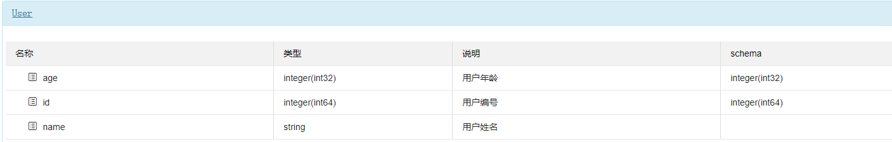

如果我们希望可以按照Model中定义的成员变量顺序来展现，那么需要我们通过`@ApiModelProperty`注解的`position`参数来实现位置的设置

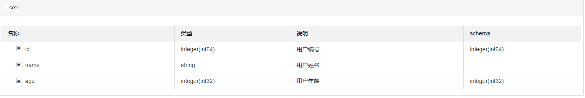

> @ApiSort(value = 5)：给接口排序
>
> @ApiOperationSupport(order = 1)：给接口里面的方法排序
>
> @ApiIgnore()：不想接口在页面上显示可以使用注解

## 五、代码示例

本文的相关例子可以查看下面仓库中的`springboot-yolo-3-1`目录：

GitHub：https://github.com/Yolo229/springboot_learning

Gitee：https://gitee.com/huanglei1111/springboot_learning