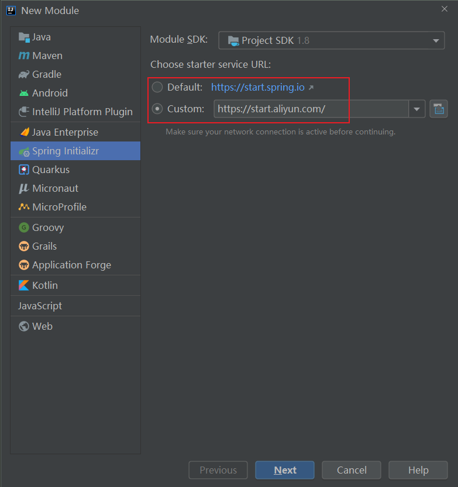
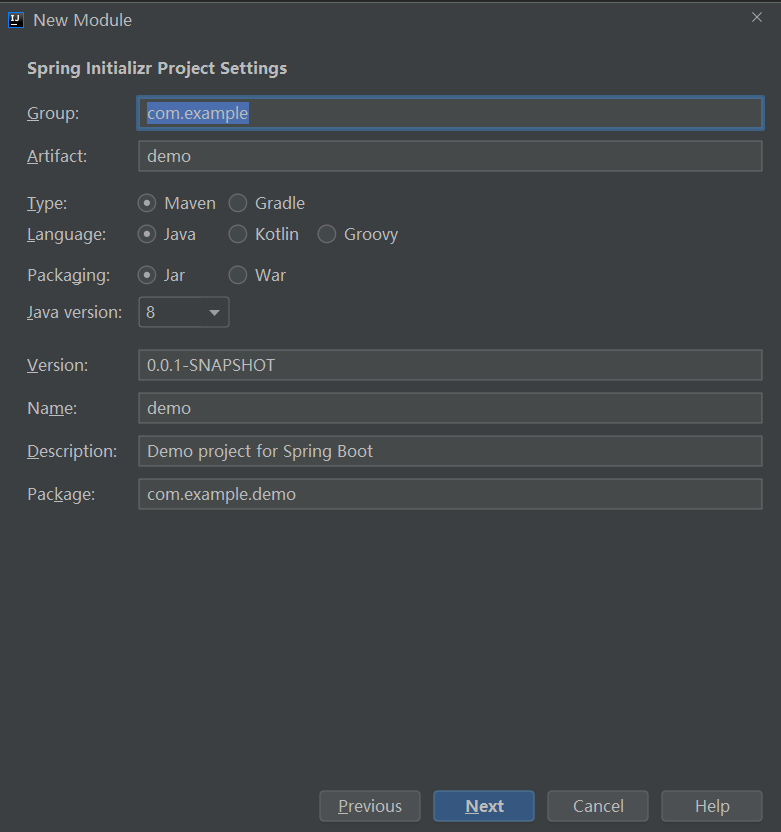
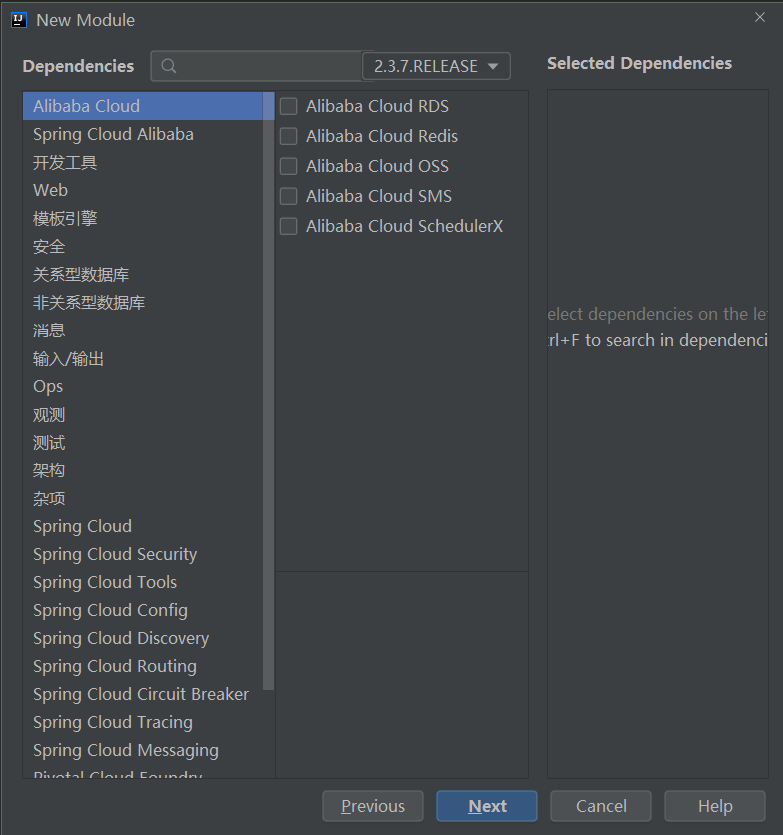
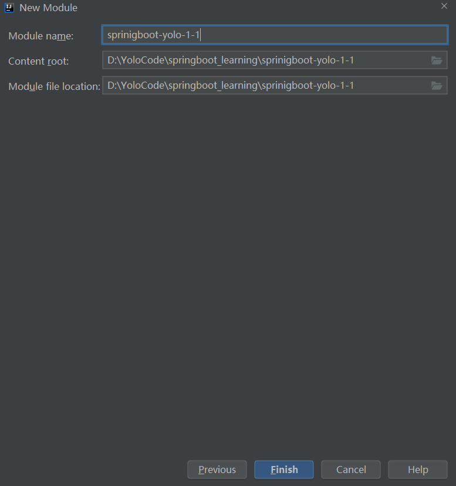
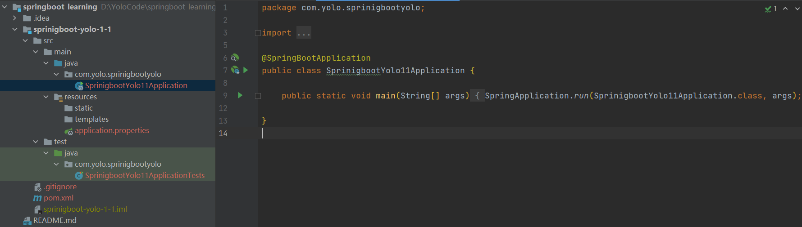

# springboot-2.x：快速入门

## 一、使用Intellij IDEA创建

**第一步**：菜单栏中选择：File => New => Project..，我们可以看到如下图所示的创建功能窗口。



其中Initial Service Url指向的地址就是Spring官方提供的Spring Initializr工具地址，所以这里创建的工程实际上也是基于它的Web工具来实现的。

如果官方提供的比较慢，可以修改成跟我一样的。

**第二步**：点击Next，等待片刻后，我们可以看到如下图所示的工程信息窗口：



**第三步**：继续点击Next，进入选择Spring Boot版本和依赖管理的窗口：



这里可以选择我们需要的依赖，这里版本我们用的是`2.3.7.RELEASE`版本

**第四步**：点击Next，进入最后关于工程物理存储的一些细节。最后，点击Finish就能完成工程的构建了



## 二、项目结构解析



通过上面步骤完成了基础项目的创建。如上图所示，Spring Boot的基础结构共三个文件（具体路径根据用户生成项目时填写的Group所有差异）

- `src/main/java`下的程序入口
- `src/main/resources`下的配置文件
- `src/test/`下的测试入口

## 三、项目依赖解析

打开`pom.xml`，一起来看看Spring Boot项目的依赖：

```xml
<?xml version="1.0" encoding="UTF-8"?>
<project xmlns="http://maven.apache.org/POM/4.0.0" xmlns:xsi="http://www.w3.org/2001/XMLSchema-instance"
         xsi:schemaLocation="http://maven.apache.org/POM/4.0.0 https://maven.apache.org/xsd/maven-4.0.0.xsd">
    <modelVersion>4.0.0</modelVersion>
    <groupId>com.yolo</groupId>
    <artifactId>sprinigboot-yolo-1-1</artifactId>
    <version>0.0.1-SNAPSHOT</version>
    <name>sprinigboot-yolo-1-1</name>
    <description>Demo project for Spring Boot</description>

    <properties>
        <java.version>1.8</java.version>
        <project.build.sourceEncoding>UTF-8</project.build.sourceEncoding>
        <project.reporting.outputEncoding>UTF-8</project.reporting.outputEncoding>
        <spring-boot.version>2.3.7.RELEASE</spring-boot.version>
    </properties>

    <dependencies>
        <dependency>
            <groupId>org.springframework.boot</groupId>
            <artifactId>spring-boot-starter-web</artifactId>
        </dependency>

        <dependency>
            <groupId>org.springframework.boot</groupId>
            <artifactId>spring-boot-starter-test</artifactId>
            <scope>test</scope>
            <exclusions>
                <exclusion>
                    <groupId>org.junit.vintage</groupId>
                    <artifactId>junit-vintage-engine</artifactId>
                </exclusion>
            </exclusions>
        </dependency>
    </dependencies>

    <dependencyManagement>
        <dependencies>
            <dependency>
                <groupId>org.springframework.boot</groupId>
                <artifactId>spring-boot-dependencies</artifactId>
                <version>${spring-boot.version}</version>
                <type>pom</type>
                <scope>import</scope>
            </dependency>
        </dependencies>
    </dependencyManagement>

    <build>
        <plugins>
            <plugin>
                <groupId>org.apache.maven.plugins</groupId>
                <artifactId>maven-compiler-plugin</artifactId>
                <version>3.8.1</version>
                <configuration>
                    <source>1.8</source>
                    <target>1.8</target>
                    <encoding>UTF-8</encoding>
                </configuration>
            </plugin>
            <plugin>
                <groupId>org.springframework.boot</groupId>
                <artifactId>spring-boot-maven-plugin</artifactId>
                <version>2.3.7.RELEASE</version>
                <configuration>
                    <mainClass>com.yolo.sprinigbootyolo.SprinigbootYolo11Application</mainClass>
                </configuration>
                <executions>
                    <execution>
                        <id>repackage</id>
                        <goals>
                            <goal>repackage</goal>
                        </goals>
                    </execution>
                </executions>
            </plugin>
        </plugins>
    </build>

</project>

```

如上所示，主要有四个部分：

- 项目元数据：创建时候输入的Project Metadata部分，也就是Maven项目的基本元素，包括：groupId、artifactId、version、name、description等
- parent：继承`spring-boot-starter-parent`的依赖管理，控制版本与打包等内容
- dependencies：项目具体依赖，这里包含了`spring-boot-starter-web`用于实现HTTP接口（该依赖中包含了Spring MVC）；`spring-boot-starter-test`用于编写单元测试的依赖包。更多功能模块的使用我们将在后面的教程中逐步展开。
- build：构建配置部分。默认使用了`spring-boot-maven-plugin`，配合`spring-boot-starter-parent`就可以把Spring Boot应用打包成JAR来直接运行。

## 四、编写一个HTTP接口

- 创建`HelloController`类，内容如下：

  ```java
  @RestController
  public class HelloController {
  
      @RequestMapping("/hello")
      public String index() {
          return "Hello World";
      }
  
  }
  ```

- 启动主程序，使用PostMan等工具发起请求：`http://localhost:8080/hello`，可以看到页面返回：Hello World

## 五、编写单元测试用例

打开的`src/test/`下的测试入口`Chapter11ApplicationTests`类。下面编写一个简单的单元测试来模拟http请求，具体如下：

```java
package com.yolo.sprinigbootyolo;


import com.yolo.sprinigbootyolo.controller.HelloController;
import org.junit.Before;
import org.junit.Test;
import org.junit.runner.RunWith;
import org.springframework.boot.test.context.SpringBootTest;
import org.springframework.http.MediaType;
import org.springframework.test.context.junit4.SpringRunner;
import org.springframework.test.web.servlet.MockMvc;
import org.springframework.test.web.servlet.request.MockMvcRequestBuilders;
import org.springframework.test.web.servlet.setup.MockMvcBuilders;

import static org.hamcrest.Matchers.equalTo;
import static org.springframework.test.web.servlet.result.MockMvcResultMatchers.content;
import static org.springframework.test.web.servlet.result.MockMvcResultMatchers.status;

@RunWith(SpringRunner.class)
@SpringBootTest(classes = SprinigbootYolo11Application.class)
public class SprinigbootYolo11ApplicationTests {

    private MockMvc mvc;

    @Before
    public void setUp() throws Exception {
        mvc = MockMvcBuilders.standaloneSetup(new HelloController()).build();
    }

    @Test
    public void contextLoads() throws Exception {
        mvc.perform(MockMvcRequestBuilders.get("/hello").accept(MediaType.APPLICATION_JSON))
                .andExpect(status().isOk())
                .andExpect(content().string(equalTo("Hello World")));
    }

}
```

使用`MockServletContext`来构建一个空的`WebApplicationContext`，这样我们创建的`HelloController`就可以在`@Before`函数中创建并传递到`MockMvcBuilders.standaloneSetup()`函数中

> 注意：引入下面内容，让status、content、equalTo函数可用

```java
import static org.hamcrest.Matchers.equalTo;
import static org.springframework.test.web.servlet.result.MockMvcResultMatchers.content;
import static org.springframework.test.web.servlet.result.MockMvcResultMatchers.status;
```

## 六、代码示例

本文的相关例子可以查看下面仓库中的`springboot-yolo-1-1`目录：

GitHub：https://github.com/Yolo229/springboot_learning

Gitee：https://gitee.com/huanglei1111/springboot_learning