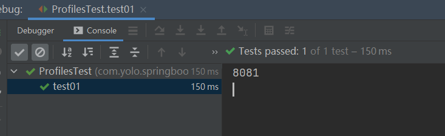
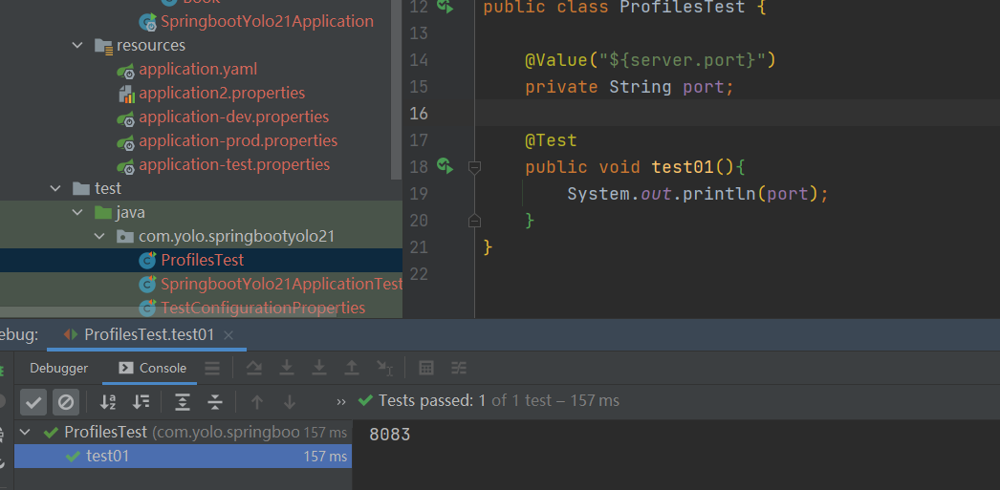

# springboot-2.x：配置详解

## 一、基础配置

Spring Boot的默认配置文件位置为： `src/main/resources/application.properties`。关于Spring Boot应用的配置内容都可以集中在该文件中了，根据我们引入的不同Starter模块，可以在这里定义诸如：容器端口名、数据库链接信息、日志级别等各种配置信息。比如，我们需要自定义web模块的服务端口号，可以在`application.properties`中添加`server.port=8888`来指定服务端口为8888，也可以通过`spring.application.name=hello`来指定应用名

Spring Boot的配置文件除了可以使用传统的properties文件之外，还支持现在被广泛推荐使用的YAML文件

通过YAML的配置方式，我们可以看到配置信息利用阶梯化缩进的方式，其结构显得更为清晰易读，同时配置内容的字符量也得到显著的减少。除此之外，YAML还可以在一个单个文件中通过使用`spring.profiles`属性来定义多个不同的环境配置。例如下面的内容，在指定为test环境时，`server.port`将使用8882端口；而在prod环境，`server.port`将使用8883端口；如果没有指定环境，`server.port`将使用8881端口

```yaml
server:
  port: 8881
---
spring:
  profiles: test
server:
  port: 8882
---
spring:
  profiles: prod
server:
  port: 8883
```

> 注意：
>
> **YAML目前还有一些不足，它无法通过`@PropertySource`注解来加载配置。但是，YAML加载属性到内存中保存的时候是有序的，所以当配置文件中的信息需要具备顺序含义时，YAML的配置方式比起properties配置文件更有优势**

## 二、配置文件的基本使用

### 参数引用

在`application.properties`中的各个参数之间，我们也可以直接通过使用PlaceHolder的方式来进行引用，就像下面的设置：

```properties
book.name=Yolo
book.author=zhangsan
book.desc=${book.author}  is writing《${book.name}》
```

### List类型

在properties文件中使用`[]`来定位列表类型，比如：

```properties
spring.my-example.url[0]=http://example.com
spring.my-example.url[1]=http://spring.io
```

也支持使用**逗号**分割的配置方式，上面与下面的配置是等价的：

```properties
spring.my-example.url=http://example.com,http://spring.io
```

而在yaml文件中使用可以使用如下配置：

```yaml
spring:
  my-example:
    url:
      - http://example.com
      - http://spring.io
```

也支持**逗号**分割的方式：

```yaml
spring:
  my-example:
    url: http://example.com, http://spring.io
```

> 注意：在Spring Boot 2.0中对于List类型的配置必须是连续的，不然会抛出`UnboundConfigurationPropertiesException`异常，所以如下配置是不允许的：

```properties
foo[0]=a
foo[2]=b
```

在Spring Boot 1.x中上述配置是可以的，`foo[1]`由于没有配置，它的值会是`null`

### Map类型

Map类型在properties和yaml中的标准配置方式如下：

```properties
spring.my-example.foo=bar
spring.my-example.hello=world
```

```yaml
spring:
  my-example:
    foo: bar
    hello: world
```

> **注意：如果Map类型的key包含非字母数字和`-`的字符，需要用`[]`括起来，比如：**

```yaml
spring:
  my-example:
    '[foo.baz]': bar
```


### 使用随机数

在一些特殊情况下，有些参数我们希望它每次加载的时候不是一个固定的值，比如：密钥、服务端口等。在Spring Boot的属性配置文件中，我们可以通过使用`${random}`配置来产生随机的int值、long值或者string字符串，这样我们就可以容易的通过配置来属性的随机生成，而不是在程序中通过编码来实现这些逻辑。

`${random}`的配置方式主要有一下几种，读者可作为参考使用。

```properties
# 随机字符串
com.didispace.blog.value=${random.value}
# 随机int
com.didispace.blog.number=${random.int}
# 随机long
com.didispace.blog.bignumber=${random.long}
# 10以内的随机数
com.didispace.blog.test1=${random.int(10)}
# 10-20的随机数
com.didispace.blog.test2=${random.int[10,20]}
```

### 命令行参数

比如：`java -jar xxx.jar --server.port=8888`，直接以命令行的方式，来设置server.port属性，另启动应用的端口设为8888。

在命令行方式启动Spring Boot应用时，连续的两个减号`--`就是对`application.properties`中的属性值进行赋值的标识。所以，`java -jar xxx.jar --server.port=8888`命令，等价于我们在`application.properties`中添加属性`server.port=8888`

通过命令行来修改属性值是Spring Boot非常重要的一个特性，通过此特性，理论上已经使得我们应用的属性在启动前是可变的，所以其中端口号也好、数据库连接也好，都是可以在应用启动时发生改变，而不同于以往的Spring应用通过Maven的Profile在编译器进行不同环境的构建。其最大的区别就是，Spring Boot的这种方式，可以让应用程序的打包内容，贯穿开发、测试以及线上部署，而Maven不同Profile的方案每个环境所构建的包，其内容本质上是不同的

## 三、配置文件与配置类的属性映射方式

### 使用注解@Value映射

我们除了可以在Spring Boot的配置文件中设置各个Starter模块中预定义的配置属性，也可以在配置文件中定义一些我们需要的自定义属性。比如在`application.properties`中添加：

```properties
book.name=Yolo
book.author=zhangsan
```

然后，在应用中我们可以通过`@Value`注解来加载这些自定义的参数，比如：

```java
    @Value("${book.name}")
    private String name;
    @Value("${book.author}")
    private String author;

    @Value("#{20-2}")
    private Integer age;

    @Value("上海")
    private String address;

    @Test
    public void contextLoads() {
        System.out.println(name +"-"+ author+"-"+age+"-"+address);
    }
```

最后我们运行查看结果：

```java
Yolo-zhangsan-18-上海
```

> 总结：Value注解的使用
>
> 基本数值。读取配置文件。写SpEL表达式

### 使用Enviroment

```java
	@Autowired
    private Environment env;
    
    @Test
    public void testEnv(){
        System.out.println(env.getProperty("book.name"));
        System.out.println(env.getProperty("book.author"));
    }
```

### 使用注解@ConfigurationProperties映射

通过注解@ConfigurationProperties(prefix=“配置文件中的key的前缀”)可以将配置文件中的配置自动与实体进行映射

```java
@RunWith(SpringRunner.class)
@SpringBootTest(classes = SpringbootYolo21Application.class)
@EnableConfigurationProperties(TestConfigurationProperties.class)
@ConfigurationProperties(prefix = "book")
public class TestConfigurationProperties {

    private String name;
    private String author;

    @Test
    public void testEnv(){
        System.out.println(name +"-" + author);
    }

    public void setName(String name) {
        this.name = name;
    }

    public void setAuthor(String author) {
        this.author = author;
    }
}
```

IDEA提示，`@ConfigurationProperties`下面有一个红线，去除红线的方法如下：

1. 添加依赖

   ```xml
           <dependency>
               <groupId>org.springframework.boot</groupId>
               <artifactId>spring-boot-configuration-processor</artifactId>
               <optional>true</optional>
           </dependency>
   ```

2. 在注解的上方增加一个注解 `@EnableConfigurationProperties({当前类.class})`

## 四、多环境配置

我们在开发Spring Boot应用时，通常同一套程序会被安装到不同环境，比如：开发、测试、生产等。其中数据库地址、服务器端口等等配置都不同，如果每次打包时，都要修改配置文件，那么非常麻烦。profile功能就是来进行动态配置切换的

### 多profile文件方式

在Spring Boot中多环境配置文件名需要满足`application-{profile}.properties`的格式，其中`{profile}`对应你的环境标识，比如：

- `application-dev.properties`：开发环境
- `application-test.properties`：测试环境
- `application-prod.properties`：生产环境

至于哪个具体的配置文件会被加载，需要在`application.properties`文件中通过`spring.profiles.active`属性来设置，其值对应配置文件中的`{profile}`值。如：`spring.profiles.active=test`就会加载`application-test.properties`配置文件内容

这里我们定义三个上面的文件，端口分别为8081,8082,8083，然后在`application.properties`中开启开发环境，然后进行测试

```java
@Value("${server.port}")
    private String port;

    @Test
    public void test01(){
        System.out.println(port);
    }
```

测试结果为：



### yml多文档方式

```yaml
---
server:
  port: 8081
spring:
  profiles: dev
---
server:
  port: 8082
spring:
  profiles: test
---
server:
  port: 8083
spring:
  profiles: prod
---
spring:
  profiles:
    active: prod #激活
book:
  author: zhangsan
  name: Yolo
```

测试结果：



## 五、加载顺序

Spring Boot为了能够更合理的重写各属性的值，使用了下面这种较为特别的属性加载顺序：

1. 命令行中传入的参数。
2. `SPRING_APPLICATION_JSON`中的属性。`SPRING_APPLICATION_JSON`是以JSON格式配置在系统环境变量中的内容。
3. `java:comp/env`中的`JNDI`属性。
4. Java的系统属性，可以通过`System.getProperties()`获得的内容。
5. 操作系统的环境变量
6. 通过`random.*`配置的随机属性
7. 位于当前应用jar包之外，针对不同`{profile}`环境的配置文件内容，例如：`application-{profile}.properties`或是`YAML`定义的配置文件
8. 位于当前应用jar包之内，针对不同`{profile}`环境的配置文件内容，例如：`application-{profile}.properties`或是`YAML`定义的配置文件
9. 位于当前应用jar包之外的`application.properties`和`YAML`配置内容
10. 位于当前应用jar包之内的`application.properties`和`YAML`配置内容
11. 在`@Configuration`注解修改的类中，通过`@PropertySource`注解定义的属性
12. 应用默认属性，使用`SpringApplication.setDefaultProperties`定义的内容

**优先级按上面的顺序有高到低，数字越小优先级越高。**

可以看到，其中第7项和第9项都是从应用jar包之外读取配置文件，所以，实现外部化配置的原理就是从此切入，为其指定外部配置文件的加载位置来取代jar包之内的配置内容。通过这样的实现，我们的工程在配置中就变的非常干净，我们只需要在本地放置开发需要的配置即可，而其他环境的配置就可以不用关心，由其对应环境的负责人去维护即可

## 六、环境属性绑定

### 简单类型

在环境变量中通过小写转换与`.`替换`_`来映射配置文件中的内容，比如：环境变量`SPRING_JPA_DATABASEPLATFORM=mysql`的配置会产生与在配置文件中设置`spring.jpa.databaseplatform=mysql`一样的效果

### List类型

由于环境变量中无法使用`[`和`]`符号，所以使用`_`来替代。任何由下划线包围的数字都会被认为是`[]`的数组形式。比如：

```properties
MY_FOO_1_ = my.foo[1]
MY_FOO_1_BAR = my.foo[1].bar
MY_FOO_1_2_ = my.foo[1][2]
```

另外，最后环境变量最后是以数字和下划线结尾的话，最后的下划线可以省略，比如上面例子中的第一条和第三条等价于下面的配置：

```properties
MY_FOO_1 = my.foo[1]
MY_FOO_1_2 = my.foo[1][2]
```

## 七、系统属性绑定

### 简单类型

系统属性与文件配置中的类似，都以移除特殊字符并转化小写后实现绑定，比如下面的命令行参数都会实现配置`spring.jpa.databaseplatform=mysql`的效果：

```properties
-Dspring.jpa.database-platform=mysql
-Dspring.jpa.databasePlatform=mysql
-Dspring.JPA.database_platform=mysql
```

### List类型

系统属性的绑定也与文件属性的绑定类似，通过`[]`来标示，比如：

```properties
-D"spring.my-example.url[0]=http://example.com"
-D"spring.my-example.url[1]=http://spring.io"
```

同样的，他也支持逗号分割的方式，比如：

```properties
-Dspring.my-example.url=http://example.com,http://spring.io
```

## 八、属性的读取

上文介绍了Spring Boot 2.0中对属性绑定的内容，可以看到对于一个属性我们可以有多种不同的表达，但是如果我们要在Spring应用程序的environment中读取属性的时候，每个属性的唯一名称符合如下规则：

- 通过`.`分离各个元素
- 最后一个`.`将前缀与属性名称分开
- 必须是字母（a-z）和数字(0-9)
- 必须是小写字母
- 用连字符`-`来分隔单词
- 唯一允许的其他字符是`[`和`]`，用于List的索引
- 不能以数字开头

> 本教程配套仓库：
>
> GitHub：https://github.com/Yolo229/springboot_learning
>
> Gitee：https://gitee.com/huanglei1111/springboot_learning

