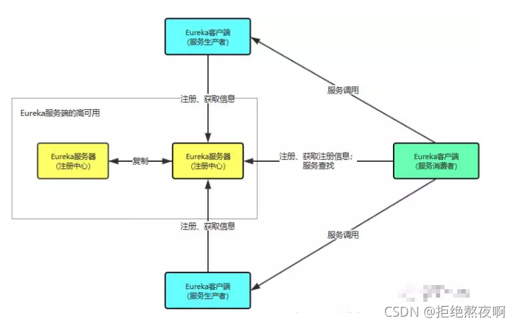
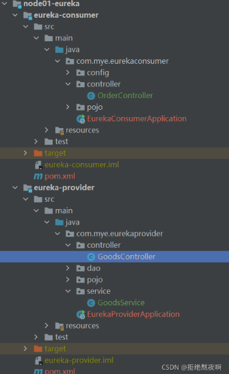
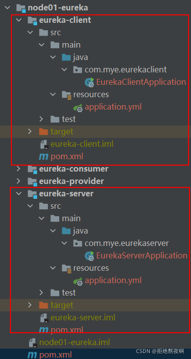

# SpringCloud：Eureka组件之服务注册与发现

## 一、Eureka简介

### 1.springcloud Eureka介绍

Spring-Cloud Eureka是springcloud集合中的一个组件，他是对Eureka的集成用于服务注册和发现。Eureka是Netflix中的一个开源框架。它和 zookeeper、Consul一样，都是用于服务注册管理的，同样，Spring-Cloud 还集成了Zookeeper和Consul

### 2、Euraka介绍

Eureka由多个instance(服务实例)组成，这些服务实例可以分为两种：Eureka Server和Eureka Client。为了便于理解，我们将Eureka client再分为Service Provider和Service Consumer。

- Eureka Server 提供服务注册和发现
- Service Provider 服务提供方，将自身服务注册到Eureka，从而使服务消费方能够找到
- Service Consumer服务消费方，从Eureka获取注册服务列表，从而能够消费服务

### 3、Eureka角色结构图




### 4、Eureka中几个核心概念

- Registe服务注册：

  当client向server注册时，client提供自身的元数据，比如ip地址、端口、运行指标的uri、主页地址等信息

- Renew服务续约：

  Client 在默认的情况下会每隔30 秒发送一次心跳来进行服务续约。通过服务续约来告知Server该Client仍然可用。正常情况下，如果Server在90 秒内没有收到Client 的心跳，Server会将Client 实例从注册列表中删除。官网建议不要更改服务续约的间隔时间

- Fetch Registries获取服务注册列表信息

  Client 从Server 获取服务注册表信息，井将其缓存在本地。Client 会使用服务注册列表信息查找其他服务的信息，从而进行远程调用。该注册列表信息定时（每30 秒） 更新一次

- Cancel服务下线

  Client 在程序关闭时可以向Eureka Server 发送下线请求。发送请求后，该客户端的实例信息将从Server 的服务注册列表中删除。该下线请求不会自动完成，需要在程序关闭时调用以下代码

  ```java
  DiscoveryManager.getinstance().shutdownComponent();
  ```

-  Eviction服务下线

  在默认情况下，当Client 连续90 秒没有向Server 发送服务续约（即心跳〉时，Server 会将该服务实例从服务注册列表删除，即服务下线

## 二、使用restTemplate进行远程调用

### 1.项目结构




### 2.eureka-provider模块

> pom文件

```xml
		<dependency>
            <groupId>org.springframework.boot</groupId>
            <artifactId>spring-boot-starter-web</artifactId>
            <version>2.3.7.RELEASE</version>
        </dependency>
```

> GoodsController.java

```java
@RestController
@RequestMapping("/goods")
public class GoodsController {
    
    @GetMapping("/findOne/{id}")
    public Goods findOne(@PathVariable("id") int id){
        return new Goods(id,"华为手机",3999,10000);
    }
}
```

> Goods.java

```java
@Data
@AllArgsConstructor
@NoArgsConstructor
public class Goods {
    private int id;
    private String title;//商品标题
    private double price;//商品价格
    private int count;//商品库存
}
```

> EurekaProviderApplication.java

```java
@SpringBootApplication
public class EurekaProviderApplication {

    public static void main(String[] args) {
        SpringApplication.run(EurekaProviderApplication.class, args);
    }

}
```

> application.yml

```yml
server:
  port: 8761
```

### 3.eureka-consumer模块

> pom文件

```xml
		<dependency>
            <groupId>org.springframework.boot</groupId>
            <artifactId>spring-boot-starter-web</artifactId>
            <version>2.3.7.RELEASE</version>
        </dependency>
```

> RestTemplateConfig.java

```java
@Configuration
public class RestTemplateConfig {
    
    @Bean
    public RestTemplate restTemplate(){
        return new RestTemplate();
    }
}
```

> Goods.java

```java
@Data
@AllArgsConstructor
@NoArgsConstructor
public class Goods {

    private int id;
    private String title;//商品标题
    private double price;//商品价格
    private int count;//商品库存

}
```

> OrderController.java

```java
@RestController
@RequestMapping("/order")
public class OrderController {

    @Autowired
    private RestTemplate restTemplate;

    @GetMapping("/goods/{id}")
    public Goods findGoodsById(@PathVariable("id") int id){
        System.out.println("findGoodsById..."+id);
        /*
            //远程调用Goods服务中的findOne接口
            使用RestTemplate
            1. 定义Bean  restTemplate
            2. 注入Bean
            3. 调用方法
         */
        String url = "http://localhost:8761/goods/findOne/"+id;
        return restTemplate.getForObject(url, Goods.class);

    }
}
```

> EurekaConsumerApplication.java

```java
@SpringBootApplication
public class EurekaConsumerApplication {

    public static void main(String[] args) {
        SpringApplication.run(EurekaConsumerApplication.class, args);
    }

}
```

> application.yml

```yml
server:
  port: 8762
```

### 4.调用结果

```
请求路径：
get   127.0.0.1:8762/order/goods/1

响应结果：
{
	"id": 1,
	"title": "华为手机",
	"price": 3999,
	"count": 10000
}
```

## 三、搭建Eureka服务端和客户端

### 1.项目结构




### 2.node01-eureka

父工程下面的pom文件

```xml
<properties>
        <spring-boot.version>2.3.7.RELEASE</spring-boot.version>
        <spring-cloud.version>Hoxton.SR9</spring-cloud.version>
    </properties>

<dependencyManagement>
        <dependencies>
            <dependency>
                <groupId>org.springframework.boot</groupId>
                <artifactId>spring-boot-dependencies</artifactId>
                <version>${spring-boot.version}</version>
                <type>pom</type>
                <scope>import</scope>
            </dependency>
            <dependency>
                <groupId>org.springframework.cloud</groupId>
                <artifactId>spring-cloud-dependencies</artifactId>
                <version>${spring-cloud.version}</version>
                <type>pom</type>
                <scope>import</scope>
            </dependency>

        </dependencies>
    </dependencyManagement>
```

下面应用的eureka的依赖不要加版本号，避免产生依赖冲突

### 3.eureka-server模块

> pom文件

```xml
	<dependencies>
        <dependency>
            <groupId>org.springframework.boot</groupId>
            <artifactId>spring-boot-starter-web</artifactId>
        </dependency>
        <dependency>
            <groupId>org.springframework.cloud</groupId>
            <artifactId>spring-cloud-starter-netflix-eureka-server</artifactId>
        </dependency>
    </dependencies>
```

> EurekaServerApplication.java

```java
@SpringBootApplication
// 启用EurekaServer
@EnableEurekaServer
public class EurekaServerApplication {

    public static void main(String[] args) {
        SpringApplication.run(EurekaServerApplication.class, args);
    }

}
```

> application.yml

```yml
server:
  port: 8761

# eureka 配置
# eureka 一共有4部分 配置
# 1. dashboard:eureka的web控制台配置
# 2. server:eureka的服务端配置
# 3. client:eureka的客户端配置
# 4. instance:eureka的实例配置

eureka:
  instance:
    hostname: localhost # 主机名
    lease-renewal-interval-in-seconds: 30 #单位是秒，默认30秒，此客户端发送心跳的频率
    lease-expiration-duration-in-seconds: 90  #单位是秒，默认90秒，表示eureka server在收到此client上次心跳之后，间隔多久没有收到，就摘除此服务
  client:
    service-url:
      defaultZone: http://${eureka.instance.hostname}:${server.port}/eureka # eureka服务端地址，将来客户端使用该地址和eureka进行通信

    register-with-eureka: false # 是否将自己的路径 注册到eureka上。eureka server 不需要的，eureka provider client 需要
    fetch-registry: false # 是否需要从eureka中抓取路径。eureka server 不需要的，eureka consumer client 需要
    enabled: true  #默认值为true，设置为false，关闭自我保护，线上建议都是打开
  server:
    eviction-interval-timer-in-ms: 2000 #无效客户端清理间隔(单位毫秒，默认是60*1000)

```

### 4.eureka-client模块

> pom文件

```xml
	<dependencies>
        <dependency>
            <groupId>org.springframework.boot</groupId>
            <artifactId>spring-boot-starter-web</artifactId>
        </dependency>
        <dependency>
            <groupId>org.springframework.cloud</groupId>
            <artifactId>spring-cloud-starter-netflix-eureka-client</artifactId>
        </dependency>
    </dependencies>
```

> EurekaClientApplication.java

```java
@SpringBootApplication
@EnableEurekaClient
public class EurekaClientApplication {

    public static void main(String[] args) {
        SpringApplication.run(EurekaClientApplication.class, args);
    }

}
```

> application.yml

```yml
server:
  port: 8001
spring:
  application:
    name: eureka-client # 设置当前应用的名称。将来会在eureka中Application显示。将来需要使用该名称来获取路径
eureka:
  instance:
    hostname: localhost # 主机名
    lease-renewal-interval-in-seconds: 30 #单位是秒，默认30秒，此客户端发送心跳的频率
    lease-expiration-duration-in-seconds: 90 #单位是秒，默认90秒，表示eureka server在收到此client上次心跳之后，间隔多久没有收到，就摘除此服务
  client:
    service-url:
      defaultZone: http://localhost:8761/eureka # eureka服务端地址，将来客户端使用该地址和eureka进行通信
    register-with-eureka: true  #默认值就是true，是否将自己的路径注册到eureka
    fetch-registry: true        #默认值就是true，是否需要从eureka中抓取路径
```

### 5.注册结果


## 四、改造eureka-consumer

> 添加eureka-client 依赖

```xml
<!-- eureka-client -->
<dependency>
    <groupId>org.springframework.cloud</groupId>
    <artifactId>spring-cloud-starter-netflix-eureka-client</artifactId>
</dependency>
```

> EurekaConsumerApplication.java

```java
@SpringBootApplication
@EnableEurekaClient
public class EurekaConsumerApplication {

    public static void main(String[] args) {
        SpringApplication.run(EurekaConsumerApplication.class, args);
    }
}
```

> application.yml

```yml
server:
  port: 8002

spring:
  application:
    name: eureka-consumer # 设置当前应用的名称。将来会在eureka中Application显示。将来需要使用该名称来获取路径

eureka:
  instance:
    hostname: localhost # 主机名
  client:
    service-url:
      defaultZone: http://localhost:8761/eureka # eureka服务端地址，将来客户端使用该地址和eureka进行通信
```

同理，eureka-provider也是一样的

### 测试结果


## 五、动态获取路径

前提：首先俩个服务都注册在eureka中

>  eureka-consumer模块

在启动类中加入@EnableDiscoveryClient

```java
@SpringBootApplication
@EnableEurekaClient
@EnableDiscoveryClient
public class EurekaConsumerApplication {

    public static void main(String[] args) {
        SpringApplication.run(EurekaConsumerApplication.class, args);
    }

}
```

在controller中进行改造

```java
@RestController
@RequestMapping("/order")
public class OrderController {

    @Autowired
    private RestTemplate restTemplate;

    @Autowired
    private DiscoveryClient discoveryClient;

    @GetMapping("/goods/{id}")
    public Goods findGoodsById(@PathVariable("id") int id){
        /*
            动态从Eureka Server 中获取 provider 的 ip 和端口
             1. 注入 DiscoveryClient 对象.激活
             2. 调用方法
         */

        //演示discoveryClient 使用
        List<ServiceInstance> instances = discoveryClient.getInstances("EUREKA-PROVIDER");

        //判断集合是否有数据
        if(instances == null || instances.size() == 0){
            //集合没有数据
            return null;
        }
        ServiceInstance instance = instances.get(0);
        String host = instance.getHost();//获取ip
        int port = instance.getPort();//获取端口
        String url = "http://"+host+":"+port+"/goods/findOne/"+id;
        // 3. 调用方法
        return restTemplate.getForObject(url, Goods.class);

    }
}
```

最后可以从eureka-provider模块中拿到数据