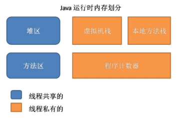
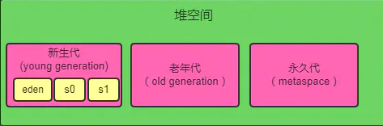
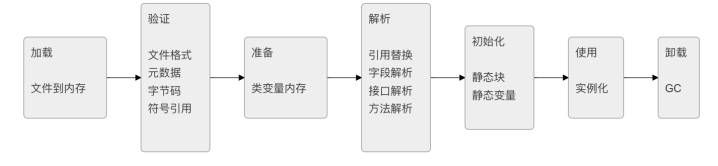

# JVM面试题

### JVM体系介绍

- <b>Class Loader类加载器</b>：负责加载 .class文件，至于它是否可以运行，则由Execution Engine决定

- <b>Native Interface本地接口</b>：本地接口的作用是融合不同的编程语言为Java所用
- <b>Execution Engine 执行引擎</b>：执行包在装载类的方法中的指令，也就是方法
- <b>Runtime data area 运行数据区</b>：虚拟机内存或者JVM内存

### JVM内存结构



- <b>程序计数器 PC Register</b>：

  > 每个线程都有一个程序计算器，就是一个指针，指向方法区中下一个将要执行的指令代码，由执行引擎读取下一条指令，是一个非常小的内存空间，几乎可以忽略不记

- <b>本地方法栈 Native Method Stac</b>：

  > Native Method Stack中登记native方法，在Execution Engine执行时加载native libraies
  >
  > 本地方法栈与虚拟机栈基本类似，区别在于虚拟机栈为虚拟机执行的java方法服务，而本地方法栈则是为Native方法服务

- <b>方法区  Method Area</b>：

  > 用于存储虚拟机加载的：静态变量+常量+类信息+运行时常量池 （类信息：类的版本、字段、方法、接口、构造函数等描述信息 ）
  >
  > 默认最小值为16MB，最大值为64MB，可以通过-XX:PermSize 和 -XX:MaxPermSize 参数限制方法区的大小

- <b>栈 JVM Stack</b>：

  > 编译器可知的各种基本数据类型(boolean、byte、char、short、int、float、long、double)、对象引用(引用指针，并非对象本身)

- <b>堆  Java Heap</b>：

  > 所有的<font color='red'>对象实例</font>以及<font color='red'>数组</font>都要在堆上分配，此内存区域的唯一目的就是存放对象实例
  >
  > 堆是Java 虚拟机所管理的内存中最大的一块。Java 堆是被所有线程共享的一块内存区域，在虚拟机启动时创建。当堆没有可用空间时,会抛出OOM异常.根据对象的存活周期不同,JVM把对象进行分代管理,由垃圾回收器进行垃圾的回收管理 

  

  刚创建的对象在新生代的Eden区中，经过GC后进入新生代的S0区中，再经过GC进入新生代的S1区中，15次GC后仍存在就进入老年代。这是按照一种回收机制进行划分的，不是固定的。若堆的空间不够实例分配，则OutOfMemoryError。

### 堆和栈的区别

```java
1、功能不同
 栈内存用来存储局部变量和方法调用，而堆内存用来存储Java中的对象。无论是成员变量，局部变量，还是类变量，它们指向的对象都存储在堆内存中。 

2、共享性不同
 栈内存是线程私有的。
 堆内存是所有线程共有的。 

3、异常错误不同
 如果栈内存或者堆内存不足都会抛出异常。
 栈空间不足：java.lang.StackOverFlowError。
 堆空间不足：java.lang.OutOfMemoryError。 

4、空间大小
 栈的空间大小远远小于堆的。 
```

### 对象分配规则

- 对象优先分配在Eden区，如果Eden区没有足够的空间时，虚拟机执行一次Minor GC。
- 大对象直接进入老年代（大对象是指需要大量连续内存空间的对象）。这样做的目的是避免在Eden区和两个Survivor区之间发生大量的内存拷贝（新生代采用复制算法收集内存）。
- 长期存活的对象进入老年代。虚拟机为每个对象定义了一个年龄计数器，如果对象经过了1次Minor GC那么对象会进入Survivor区，之后每经过一次Minor GC那么对象的年龄加1，知道达到阀值对象进入老年区。
- 动态判断对象的年龄。如果Survivor区中相同年龄的所有对象大小的总和大于Survivor空间的一半，年龄大于或等于该年龄的对象可以直接进入老年代。
- 空间分配担保。每次进行Minor GC时，JVM会计算Survivor区移至老年区的对象的平均大小，如果这个值大于老年区的剩余值大小则进行一次Full GC，如果小于检查HandlePromotionFailure设置，如果true则只进行Monitor GC,如果false则进行Full GC。

### 深拷贝和浅拷贝

```java
浅拷贝（shallowCopy）只是增加了一个指针指向已存在的内存地址
深拷贝（deepCopy）是增加了一个指针并且申请了一个新的内存，使这个增加的指针指向这个新的内存
    
浅复制：仅仅是指向被复制的内存地址，如果原地址发生改变，那么浅复制出来的对象也会相应的改变
深复制：在计算机中开辟一块新的内存地址用于存放复制的对象    
```

### 类加载与卸载



其中**验证,准备,解析**合称链接

**加载**通过类的完全限定名,查找此类字节码文件,利用字节码文件创建Class对象.

**验证**确保Class文件符合当前虚拟机的要求,不会危害到虚拟机自身安全.

**准备**进行内存分配,为static修饰的类变量分配内存,并设置初始值(0或null).不包含final修饰的静态变量,因为final变量在编译时分配.

**解析**将常量池中的符号引用替换为直接引用的过程.直接引用为直接指向目标的指针或者相对偏移量等.

**初始化**主要完成静态块执行以及静态变量的赋值.先初始化父类,再初始化当前类.只有对类主动使用时才会初始化.

### 类加载器分类

主要有一下四种类加载器:

1.  启动类加载器(Bootstrap ClassLoader)用来加载java核心类库，无法被java程序直接引用。
2.  扩展类加载器(extensions class loader):它用来加载 Java 的扩展库。Java 虚拟机的实现会提供一个扩展库目录。该类加载器在此目录里面查找并加载 Java 类。
3.  系统类加载器（system class loader）：它根据 Java 应用的类路径（CLASSPATH）来加载 Java 类。一般来说，Java 应用的类都是由它来完成加载的。可以通过 ClassLoader.getSystemClassLoader()来获取它。
4.  用户自定义类加载器，通过继承 java.lang.ClassLoader类的方式实现。

### 双亲委派机制

```java
双亲委派模式,即加载器加载类时先把请求委托给自己的父类加载器执行,直到顶层的启动类加载器.父类加载器能够完成加载则成功返回,不能则子类加载器才自己尝试加载
    
好处：
    1. 避免类的重复加载
	2. 避免Java的核心API被篡改
```

### 垃圾回收(GC)

- <b>GC的区域在哪里</b>

  ```java
  jvm 中，程序计数器、虚拟机栈、本地方法栈都是随线程而生随线程而灭，栈随着方法的进入和退出做入栈和出栈操作，实现了自动的内存清理，因此，我们的内存垃圾回收主要集中于 java 堆和方法区中
  ```

- <b>GC的对象</b>

  ```java
  需要进行回收的对象就是已经没有存活的对象，判断一个对象是否存活常用的有两种办法
      1.引用计数：每个对象有一个引用计数属性，新增一个引用时计数加1，引用释放时计数减1，计数为0时可以回收。此方法简单，无法解决对象相互循环引用的问题
      2.可达性分析:从GC Roots开始向下搜索，搜索所走过的路径称为引用链。当一个对象到GC Roots没有任何引用链相连时，则证明此对象是不可用的。不可达对象
  ```

- <b>什么时候触发GC</b>

  ```java
  1.程序调用System.gc时可以触发
  2.系统自身来决定GC触发的时机(当内存大小不足时，则会启动GC线程并停止应用线程)    
  ```

- <b>GC做了什么事</b>

  ```java
  主要做了清理对象，整理内存的工作。Java堆分为新生代和老年代，采用了不同的回收方式。（GC常用算法有：标记-清除算法，标记-压缩算法，复制算法，分代收集算法。目前主流的JVM（HotSpot）采用的是分代收集算法。）
  ```

### minor GC 和 Full GC

```java
GC又分为 minor GC 和 Full GC
    
MGC触发条件：
    当Eden区(新生代)满时，触发Minor GC
    
FGC触发条件：
    1.调用System.gc时
    2.老年代空间不足
    3.方法区空间不足
    4.通过MGC后进入老年代的平均大小大于老年代的可用内存
```

### JVM的永久代中会发生垃圾回收么

```java
垃圾回收不会发生在永久代，如果永久代满了或者是超过了临界值，会触发完全垃圾回收(Full GC)。如果你仔细查看垃圾收集器的输出信息，就会发现永久代也是被回收的。这就是为什么正确的永久代大小对避免Full GC是非常重要的原因。请参考下Java8：从永久代到元数据区 (注：Java8中已经移除了永久代，新加了一个叫做元数据区的native内存区) 
```

### 简述分代垃圾回收器是怎么工作的

```java
分代回收器有两个分区：老生代和新生代，新生代默认的空间占比总空间的 1/3，老生代的默认占比是 2/3。

新生代使用的是复制算法，新生代里有 3 个分区：Eden、To Survivor、From Survivor，它们的默认占比是 8:1:1，它的执行流程如下：
    1.把 Eden + From Survivor 存活的对象放入 To Survivor 区
    2.清空 Eden 和 From Survivor 分区
    3.From Survivor 和 To Survivor 分区交换，From Survivor 变 To Survivor，To Survivor 变 From Survivor
    
每次在 From Survivor 到 To Survivor 移动时都存活的对象，年龄就 +1，当年龄到达 15（默认配置是 15）时，升级为老生代。大对象也会直接进入老生代。

老生代当空间占用到达某个值之后就会触发全局垃圾收回，一般使用标记整理的执行算法。以上这些循环往复就构成了整个分代垃圾回收的整体执行流程。
```

### 内存分配策略

- <b>对象优先在 Eden 区分配</b>：多数情况，对象都在新生代 Eden 区分配。当 Eden 区分配没有足够的空间进行分配时，虚拟机将会发起一次 Minor GC。如果本次 GC 后还是没有足够的空间，则将启用分配担保机制在老年代中分配内存

  > 1.Minor GC 是指发生在新生代的 GC，因为 Java 对象大多都是朝生夕死，所有 Minor GC 非常频繁，一般回收速度也非常快；
  > 	2.Major GC/Full GC 是指发生在老年代的 GC，出现了 Major GC 通常会伴随至少一次 Minor GC。Major GC 的速度通常会比 Minor GC 慢 10 倍以上

- <b>大对象直接进入老年代</b>：所谓大对象是指需要大量连续内存空间的对象，频繁出现大对象是致命的，会导致在内存还有不少空间的情况下提前触发 GC 以获取足够的连续空间来安置新对象
- <b>长期存活对象将进入老年代</b>：虚拟机采用分代收集的思想来管理内存，那么内存回收时就必须判断哪些对象应该放在新生代，哪些对象应该放在老年代。因此虚拟机给每个对象定义了一个对象年龄的计数器，如果对象在 Eden 区出生，并且能够被 Survivor 容纳，将被移动到 Survivor 空间中，这时设置对象年龄为 1。对象在 Survivor 区中每「熬过」一次 Minor GC 年龄就加 1，当年龄达到一定程度（默认 15） 就会被晋升到老年代

### 垃圾收集算法

GC最基础的算法有三种： 标记 -清除算法、复制算法、标记-压缩算法，我们常用的垃圾回收器一般都采用分代收集算法。

- 标记 -清除算法，“标记-清除”（Mark-Sweep）算法，如它的名字一样，算法分为“标记”和“清除”两个阶段：首先标记出所有需要回收的对象，在标记完成后统一回收掉所有被标记的对象。
- 复制算法，“复制”（Copying）的收集算法，它将可用内存按容量划分为大小相等的两块，每次只使用其中的一块。当这一块的内存用完了，就将还存活着的对象复制到另外一块上面，然后再把已使用过的内存空间一次清理掉。
- 标记-压缩算法，标记过程仍然与“标记-清除”算法一样，但后续步骤不是直接对可回收对象进行清理，而是让所有存活的对象都向一端移动，然后直接清理掉端边界以外的内存
- 分代收集算法，“分代收集”（Generational Collection）算法，把Java堆分为新生代和老年代，这样就可以根据各个年代的特点采用最适当的收集算法。

### java中内存泄漏以及产生的原因

```
内存泄漏：内存泄漏是指无用对象(不在使用的对象)，持续占用内存或者无用对象的内存得不到及时的释放，从而造成的内存空间的浪费称为内存泄漏

内存溢出：通俗理解就是内存不够，通常在运行大型软件或游戏时，软件或游戏所需要的内存远远超出了你主机内安装的内存所承受大小，就叫内存溢出

原因：
长生命周期的对象持有短生命周期的对象就很可能发送内存泄漏，尽管短生命周期对象已经不在需要，可是长生命周期对象持有它的引用而导致不能回收

发生场景：
- 静态集合类引起内存泄漏：例如hashmap这些静态变量的生命周期和应用程序一致，可是他们所引用的对象的Object对象不能被释放
- 监听器：在释放资源的时候，没有删掉监听器
- 各种连接：例如数据库连接，io操作，如果没有手动.close，就不会自动内GC回收
```

### 调优工具

```java
常用调优工具分为两类,jdk自带监控工具：jconsole和jvisualvm，第三方有：MAT(Memory Analyzer Tool)、GChisto。

- jconsole，Java Monitoring and Management Console是从java5开始，在JDK中自带的java监控和管理控制台，用于对JVM中内存，线程和类等的监控
- jvisualvm，jdk自带全能工具，可以分析内存快照、线程快照；监控内存变化、GC变化等。
- MAT，Memory Analyzer Tool，一个基于Eclipse的内存分析工具，是一个快速、功能丰富的Java heap分析工具，它可以帮助我们查找内存泄漏和减少内存消耗
- GChisto，一款专业分析gc日志的工具
```

### 你知道哪些JVM性能调优

```java
1.设定堆内存大小
-Xmx：堆内存最大限制。

2.设定新生代大小。 新生代不宜太小，否则会有大量对象涌入老年代
-XX:NewSize：新生代大小
-XX:NewRatio 新生代和老生代占比
-XX:SurvivorRatio：伊甸园空间和幸存者空间的占比

3.设定垃圾回收器 年轻代用 -XX:+UseParNewGC 年老代用-XX:+UseConcMarkSweepGC
```

### 常用的 JVM 调优的参数都有哪些

- -Xms2g：初始化推大小为 2g
- -Xmx2g：堆最大内存为 2g
- -XX:NewRatio=4：设置年轻的和老年代的内存比例为 1:4
- -XX:SurvivorRatio=8：设置新生代 Eden 和 Survivor 比例为 8:2
- –XX:+UseParNewGC：指定使用 ParNew + Serial Old 垃圾回收器组合
- -XX:+UseParallelOldGC：指定使用 ParNew + ParNew Old 垃圾回收器组合
- -XX:+UseConcMarkSweepGC：指定使用 CMS + Serial Old 垃圾回收器组合
- -XX:+PrintGC：开启打印 gc 信息
- -XX:+PrintGCDetails：打印 gc 详细信息