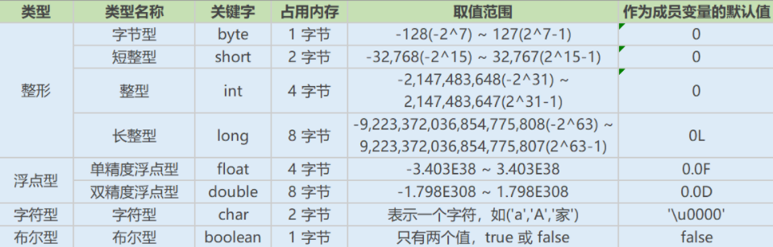
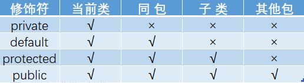

# Java基础知识面试题

### JVM、JRE、JDK的关系

- JVM是Java虚拟机，Java程序需要运行在虚拟机上，不同的平台有自己的虚拟机，因此Java语言可以实现跨平台。
- JRE包括`JVM`和Java程序所需的`核心类库`等。核心类库主要是java.lang包。
- JDK是提供给Java开发人员使用的，其中包含了`Java的开发工具`，也`包括了JRE`。其中的开发工具：编译工具(javac.exe)，打包工具(jar.exe)等

### Java有哪些数据类型



### 常见的错误计算

```java
- 用最有效率的方法计算 2 乘以 8
	2 << 3（左移 3 位相当于乘以 2 的 3 次方，右移 3 位相当于除以 2 的 3 次方）
    
- Math.round(11.5) 等于多少？Math.round(-11.5)等于多少
    Math.round(11.5)的返回值是 12，Math.round(-11.5)的返回值是-11。四舍五入的原理是在参数上加 0.5 然后进行下取整。
    
- float f=3.4;是否正确
    不正确。3.4 是双精度数，将双精度型（double）赋值给(单精度型)浮点型（float）属于下转型，此需要强制类型转换float f =(float)3.4; 或者写成 float f =3.4F
    
- short s1 = 1; s1 = s1 + 1;有错吗?short s1 = 1; s1 += 1;有错吗
    对于 short s1 = 1; s1 = s1 + 1;由于 1 是 int 类型，因此 s1+1 运算结果也是 int型，需要强制转换类型才能赋值给 short 型。而 short s1 = 1; s1 += 1;可以正确编译，因为 s1+= 1;相当于 s1 = (short(s1 + 1);其中有隐含的强制类型转换。
```

### 访问修饰符以及作用区间

private : 在同一类内可见。使用对象：变量、方法。 注意：不能修饰类（外部类）

default (即缺省，什么也不写，不使用任何关键字）: 在同一包内可见，不使用任何修饰符。使用对象：类、接口、变量、方法。

protected : 对同一包内的类和所有子类可见。使用对象：变量、方法。 注意：不能修饰类（外部类）

public : 对所有类可见。使用对象：类、接口、变量、方法



### &和&&的区别

&运算符有两种用法：

1. 按位与
2. 逻辑与

&&运算符是短路与运算。逻辑与跟短路与的差别是非常巨大的，虽然二者都要求运算符左右两端的布尔值都是true 整个表达式的值才是 true。&&之所以称为短路运算，是因为如果&&左边的表达式的值是 false，右边的表达式会被直接短路掉，不会进行运算。

### final 有什么用？

用于修饰类、属性和方法；

- 被final修饰的类不可以被继承
- 被final修饰的方法不可以被重写
- 被final修饰的变量不可以被改变，被final修饰不可变的是变量的引用，而不是引用指向的内容，引用指向的内容是可以改变的

### final finally finalize区别

- final可以修饰类、变量、方法，修饰类表示该类不能被继承、修饰方法表示该方法不能被重写、修饰变量表示该变量是一个常量不能被重新赋值。
- finally一般作用在try-catch代码块中，在处理异常的时候，通常我们将一定要执行的代码方法finally代码块中，表示不管是否出现异常，该代码块都会执行，一般用来存放一些关闭资源的代码。
- finalize是一个方法，属于Object类的一个方法，而Object类是所有类的父类，该方法一般由垃圾回收器来调用，当我们调用System.gc() 方法的时候，由垃圾回收器调用finalize()，回收垃圾，一个对象是否可回收的最后判断。

### this与super的区别

- super:　它引用当前对象的直接父类中的成员，this：它代表当前对象名
- super()和this()类似,区别是，super()在子类中调用父类的构造方法，this()在本类内调用本类的其它构造方法
- super()和this()均需放在构造方法内第一行
- this和super不能同时出现在一个构造函数里面，因为this必然会调用其它的构造函数，其它的构造函数必然也会有super语句的存在，所以在同一个构造函数里面有相同的语句，就失去了语句的意义，编译器也不会通过
- this()和super()都指的是对象，所以，均不可以在static环境中使用。包括：static变量,static方法，static语句块
- 从本质上讲，this是一个指向本对象的指针, 然而super是一个Java关键字

### static存在的主要意义

- static的主要意义是在于创建独立于具体对象的域变量或者方法。**以致于即使没有创建对象，也能使用属性和调用方法**
- static关键字还有一个比较关键的作用就是 **用来形成静态代码块以优化程序性能**。static块可以置于类中的任何地方，类中可以有多个static块。在类初次被加载的时候，会按照static块的顺序来执行每个static块，并且只会执行一次
- 为什么说static块可以用来优化程序性能，是因为它的特性:只会在类加载的时候执行一次。因此，很多时候会将一些只需要进行一次的初始化操作都放在static代码块中进行

### static应用场景和注意事项

因为static是被类的实例对象所共享，因此如果**某个成员变量是被所有对象所共享的，那么这个成员变量就应该定义为静态变量**。

```java
常见的static应用场景:
	1、修饰成员变量 2、修饰成员方法 3、静态代码块 4、修饰类【只能修饰内部类也就是静态内部类】 5、静态导包
        
注意事项:
	1、静态只能访问静态。 2、非静态既可以访问非静态的，也可以访问静态的。
```

### break ,continue ,return 的区别及作用

- break 跳出总上一层循环，不再执行循环(结束当前的循环体)
- continue 跳出本次循环，继续执行下次循环(结束正在执行的循环 进入下一个循环条件)
- return 程序返回，不再执行下面的代码(结束当前的方法 直接返回)

### 在 Java 中，如何跳出当前的多重嵌套循环

在Java中，要想跳出多重循环，可以在外面的循环语句前定义一个标号，然后在里层循环体的代码中使用带有标号的break 语句，即可跳出外层循环

```java
public static void main(String[] args) {
    ok:
    for (int i = 0; i < 10; i++) {
        for (int j = 0; j < 10; j++) {
            System.out.println("i=" + i + ",j=" + j);
            if (j == 5) {
                break ok;
            }
        }
    }
}
```

### 面向对象和面向过程的区别

- 面向过程性能比面向对象高，因为类调用时需要实例化，开销比较大，比较消耗资源
- 面向对象易维护、易复用、易扩展，由于面向对象有封装、继承、多态性的特性，可以设计出低耦合的系统，使系统更加灵活、更加易于维护

### 面向对象的三大特征

<font color='red'>封装：</font>

封装把一个对象的属性私有化，同时提供一些可以被外界访问的属性的方法

<font color='red'>继承：</font>

继承是使用已存在的类的定义作为基础建立新类的技术，新类的定义可以增加新的数据或新的功能，也可以用父类的功能，但不能选择性地继承父类。通过使用继承我们能够非常方便地复用以前的代码。

> 注意：
>
> 1. 子类拥有父类非 private 的属性和方法。
> 2. 子类可以拥有自己属性和方法，即子类可以对父类进行扩展。
> 3. 子类可以用自己的方式实现父类的方法。

<font color='red'>多态：</font>

父类或接口定义的引用变量可以指向子类或具体实现类的实例对象。提高了程序的拓展性。

在Java中有两种形式可以实现多态：

1、继承（多个子类对同一方法的重写）

2、接口（实现接口并覆盖接口中同一方法）。

方法重载（overload）实现的是编译时的多态性（也称为前绑定），而方法重写（override）实现的是运行时的多态性（也称为后绑定）。

> 多态的实现：
>
> 1、继承：在多态中必须存在有继承关系的子类和父类。
>
> 2、重写：子类对父类中某些方法进行重新定义，在调用这些方法时就会调用子类的方法。
>
> 3、向上转型：在多态中需要将子类的引用赋给父类对象，只有这样该引用才能够具备技能调用父类的方法和子类的方法。

### 抽象类和接口的对比

相同点：

- 接口和抽象类都不能实例化
- 都位于继承的顶端，用于被其他实现或继承
- 都包含抽象方法，其子类都必须覆写这些抽象方法

不同点：

| 参数       | 抽象类                                                       | 接口                                                         |
| ---------- | ------------------------------------------------------------ | ------------------------------------------------------------ |
| 声明       | 抽象类使用abstract关键字声明                                 | 接口使用interface关键字声明                                  |
| 实现       | 子类使用extends关键字来继承抽象类。如果子类不是抽象类的话，它需要提供抽象类中所有声明的方法的实现 | 子类使用implements关键字来实现接口。它需要提供接口中所有声明的方法的实现 |
| 构造器     | 抽象类可以有构造器                                           | 接口不能有构造器                                             |
| 访问修饰符 | 抽象类中的方法可以是任意访问修饰符                           | 接口方法默认修饰符是public。并且不允许定义为 private 或者 protected |
| 多继承     | 一个类最多只能继承一个抽象类                                 | 一个类可以实现多个接口                                       |
| 字段声明   | 抽象类的字段声明可以是任意的                                 | 接口的字段默认都是 static 和 final 的                        |

### 普通类和抽象类有哪些区别？

- 普通类不能包含抽象方法，抽象类可以包含抽象方法。
- 抽象类不能直接实例化，普通类可以直接实例化。

### 重载（Overload）和重写（Override）的区别

方法的重载和重写都是实现多态的方式，区别在于前者实现的是编译时的多态性，而后者实现的是运行时的多态性。

重载：发生在同一个类中，<font color='red'>方法名相同参数列表不同（参数类型不同、个数不同、顺序不同）</font>，与方法返回值和访问修饰符无关，即重载的方法不能根据返回类型进行区分

重写：发生在父子类中，方法名、<font color='red'>参数列表必须相同，返回值小于等于父类，抛出的异常小于等于父类，访问修饰符大于等于父类（里氏代换原则）</font>；如果父类方法访问修饰符为private则子类中就不是重写。

### 构造器（constructor）是否可被重写（override）

构造器不能被继承，因此不能被重写，但可以被重载。

### == 和 equals 的区别是什么

<b>==：</b>它的作用是判断两个对象的地址是不是相等。即，判断两个对象是不是同一个对象。(基本数据类型 == 比较的是值，引用数据类型 == 比较的是内存地址)

<b>equals()：</b>它的作用也是判断两个对象是否相等。

情况1：类没有覆盖 equals() 方法。则通过 equals() 比较该类的两个对象时，等价于通过“==”比较这两个对象。

情况2：类覆盖了 equals() 方法。一般，我们都覆盖 equals() 方法来两个对象的内容相等；若它们的内容相等，则返回 true (即，认为这两个对象相等)。

### 两个对象的 hashCode() 相同，则 equals() 也一定为 true，对吗？

hashCode() 的作用是获取哈希码，也称为散列码；它实际上是返回一个int整数。这个哈希码的作用是确定该对象在哈希表中的索引位置

当你把对象加入 HashSet 时，HashSet 会先计算对象的 hashcode 值来判断对象加入的位置，同时也会与其他已经加入的对象的 hashcode 值作比较，如果没有相符的hashcode，HashSet会假设对象没有重复出现。但是如果发现有相同 hashcode 值的对象，这时会调用 equals()方法来检查 hashcode 相等的对象是否真的相同。如果两者相同，HashSet 就不会让其加入操作成功。如果不同的话，就会重新散列到其他位置。这样我们就大大减少了 equals 的次数，相应就大大提高了执行速度。

```java
String str1 = "通话";
String str2 = "重地";
System.out.println(String.format("str1：%d | str2：%d", str1.hashCode(),str2.hashCode()));
System.out.println(str1.equals(str2));

str1：1179395 | str2：1179395
false
    
因为在散列表中，hashCode()相等即两个键值对的哈希值相等，然而哈希值相等，并不一定能得出键值对相等。    
```

### 反射概述与获取class对象的三种方式

java反射机制是在运行状态中，对于任意一个类，都能够知道这个类的所有属性和方法；对于人鱼对象都可以调用他的任意属性和方法；这种动态获取信息以及动态调用对象的方法的功能称为Java语言的反射机制

- Class.forName(全类名) ——>源代码阶段
- 类名.class ——>Class对象阶段
- 对象名.getClass() ——>运行时阶段

```java
public class Test {
    public static void main(String[] args) throws ClassNotFoundException {
        //1.class.forName(全类名)
        Class clazz = Class.forName("com.itheima.ClassDemo.Student");
        System.out.println(clazz);
        //2.类名.class
        Class<Student> clazz2 = Student.class;
        System.out.println(clazz2);
        //3.对象名.getClass
        Student student = new Student();
        Class<? extends Student> clazz3 = student.getClass();
        System.out.println(clazz3);
    }
}
```

