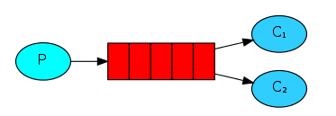

# RabbitMQ面试题

### 为什么使用MQ

```java
简答：异步，消峰，解耦

- 解耦
场景：a系统发送消息给bcd，如果c，不需要了，e系统想要了，这样耦合性就很高，如果采用MQ，a系统只需要发送消息给MQ，其他系统想要，就去MQ中消费消息，不想要就取消消费

- 异步
不需要同步执行的远程调用可以有效提高响应时间

- 消峰
减少高峰时期对服务器压力
```

### MQ有哪些常用问题，如何解决这些问题

> MQ的常见问题有

```
1.消息的顺序性
2.消息的重复问题
```

> 消息的顺序问题

```
消息有序指的是可以按照消息的发送顺序来消费

场景：
假如生产者产生了 2 条消息：M1、M2，假定 M1 发送到 S1，M2 发送到 S2，如果要保证 M1 先于 M2 被消费，怎么做？
解决方法：
保证生产者 - MQServer - 消费者是一对一对一的关系
```

> 消息的重复问题(消息的幂等性)

```
造成消息重复的根本原因是：网络不可达
场景：如果消费端收到两条一样的消息，应该怎样处理？
解决方法：
利用一张日志表来记录已经处理成功的消息的 ID，如果新到的消息 ID 已经在日志表中，那么就不再处理这条消息
```

### 多个mq如何选择

| **MQ**   | **描述**                                                     |
| -------- | ------------------------------------------------------------ |
| RabbitMQ | erlang开发，对消息堆积的支持并不好，当大量消息积压的时候，会导致 RabbitMQ 的性能急剧下降。每秒钟可以处理几万到十几万条消息。 |
| RocketMQ | java开发，面向互联网集群化功能丰富，对在线业务的响应时延做了很多的优化，大多数情况下可以做到毫秒级的响应，每秒钟大概能处理几十万条消息。 |
| Kafka    | Scala开发，面向日志功能丰富，性能最高。当你的业务场景中，每秒钟消息数量没有那么多的时候，Kafka 的时延反而会比较高。所以，Kafka 不太适合在线业务场景。 |
| ActiveMQ | java开发，简单，稳定，性能不如前面三个。小型系统用也ok，但是不推荐。推荐用互联网主流的。 |

### RabbitMQ基本概念

```
Broker:简单来说就是消息队列服务器实体
Exchange:消息交换机，它指定消息按什么规则，路由到那个队列
Queue：消息队列载体，每个消息都会被投入到一个多个队列
Binding： 绑定，它的作用就是把exchange和queue按照路由规则绑定起来
Routing Key： 路由关键字，exchange根据这个关键字进行消息投递
Producer： 消息生产者，就是投递消息的程序
Consumer： 消息消费者，就是接受消息的程序
Channel： 消息通道，在客户端的每个连接里，可建立多个channel，每个channel代表一个会话任务
```

### RabbitMQ的工作模式

> 1.simple模式(最简单的收发模式)



```
1.生产者生成消息，把消息放入消息队列中
2.消费者监听消息队列，如果有消息就消费，消息被消费后，会从消息队列中删除
隐患：如果消息在消费队列中没有被被消费就丢失了，这个时候就需要设置手动ack，然后消费者消费消息后需要发送ack消息给队列，否则会造成内存溢出
```

> work工作模式(资源的竞争)


```
1.消息产生者将消息放入队列消费者可以有多个,消费者1,消费者2同时监听同一个消息队列
2.消费者1和消费者2同时枪当前消息队列的内容，谁先拿到谁负责消费
隐患：高并发情况下,默认会产生某一个消息被多个消费者共同使用,可以设置一个开关(syncronize) 保证一条消息只能被一个消费者使用
```

> publish/subscribe发布订阅(共享资源)


```
1、每个消费者监听自己的队列
2、生产者将消息发给broker，由交换机将消息转发到绑定此交换机的每个队列，每个绑定交换机的队列都将接收到消息。
```

> routing路由模式


```
1.消费者生产消息发送给交换机按照路由判断，交换机根据路由的key，只能匹配上路由可以对应的消息队列，对应的消费者才能消费
2.根据业务功能定义路由字符串(路由是字符串)
3.从系统的代码逻辑中获取对应的功能字符串，将消息任务扔到对应的队列中
```

> topic主题模式(路由模式的一种)


```
1.消息生产者生产消息，把消息交给交换机
2.交换机根据key的规则模糊匹配搭到对应的队列，由队列的监听消费者接受消息消费

星号井号代表通配符，星号代表多个单词,井号代表一个单词

在我的理解看来就是routing查询的一种模糊匹配，就类似sql的模糊查询方式
```

### 如何保证RabbitMQ消息的顺序性

```
拆分多个 queue，每个 queue 一个 consumer，就是多一些 queue 而已，确实是麻烦点；或者就一个 queue 但是对应一个 consumer，然后这个 consumer 内部用内存队列做排队，然后分发给底层不同的 worker 来处理。
```

### 消息如何分发

```
若该队列至少有一个消费者订阅，消息将以循环（round-robin）的方式发送给消费者。每条消息只会分发给一个订阅的消费者（前提是消费者能够正常处理消息并进行确认）。通过路由可实现多消费的功能
```

### 消息基于什么传输？

```
由于 TCP 连接的创建和销毁开销较大，且并发数受系统资源限制，会造成性能瓶颈。RabbitMQ 使用信道的方式来传输数据。信道是建立在真实的 TCP 连接内的虚拟连接，且每条 TCP 连接上的信道数量没有限制
```

### 如何保证消息的幂等性

```
- 先说为什么会重复消费：正常情况下，消费者在消费消息的时候，消费完毕后，会发送一个确认消息给消息队列，消息队列就知道该消息被消费了，就会将该消息从消息队列中删除,可是由于网络等原因，消息队列没有接受到消息，导致消息没有被删除
- 解决方法：消费一条消息就往数据库中插入一条数据，如果一条消息消费了俩次，在消费之前先进行判断，如果已经有了就说明消费过了
```

### 如何确保消息正确地发送至 RabbitMQ？ 如何确保消息接收方消费了消息？

> **发送方确认模式**

```
将信道设置成confirm模式(发送方确认模式)，信道会给每一个消息一个唯一的id，一旦消息到达目的队列后或者被持久化后，信道会发送一个确定给生产者(包含消息唯一id)，如果 RabbitMQ 发生内部错误从而导致消息丢失，会发送一条 nack（notacknowledged，未确认）消息
```

> 接收方确定机制

```
消费者接收每一条消息后都必须进行确认（消息接收和消息确认是两个不同操作）。只有消费者确认了消息，RabbitMQ 才能安全地把消息从队列中删除

这里并没有用到超时机制，RabbitMQ 仅通过 Consumer 的连接中断来确认是否需要重新发送消息。也就是说，只要连接不中断，RabbitMQ 给了 Consumer 足够长的时间来处理消息。保证数据的最终一致性

如果消费者接收到消息，在确认之前断开了连接或取消订阅，RabbitMQ 会认为消息没有被分发，然后重新分发给下一个订阅的消费者。（可能存在消息重复消费的隐患，需要去重）
如果消费者接收到消息却没有确认消息，连接也未断开，则 RabbitMQ 认为该消费者繁忙，将不会给该消费者分发更多的消息
```

### 如何保证RabbitMQ消息的可靠性

> 生产者丢失

```
从生产者弄丢数据这个角度来看，RabbitMQ提供transaction和confirm模式来确保生产者不丢消息；

- confirm模式:一旦channel进入confirm模式，所有在这个信道的消息，都有一个唯一的id，一旦消息被消费，如何rabbitMQ就会发送一个ACK给生产者，这个时候生产者就知道发送成功了，如果rabbitMQ没有处理该消息，就会发送一个Nack消息给生产者，如何进行重试

- transaction机制:发送消息前，开启事务（channel.txSelect()）,然后发送消息，如果发送过程中出现什么异常，事务就会回滚（channel.txRollback()）,如果发送成功则提交事务（channel.txCommit()）
```

> 消息队列丢失数据

```
处理消息队列丢数据的情况，一般是开启持久化磁盘的配置

- 这个持久化配置可以和confirm机制配合使用，你可以在消息持久化磁盘后，再给生产者发送一个Ack信号。这样，如果消息持久化磁盘之前，rabbitMQ阵亡了，那么生产者收不到Ack信号，生产者会自动重发

- 如何持久化
	1.将queue的持久化标识durable设置为true,则代表是一个持久的队列
	2.发送消息的时候将deliveryMode=2
```

> 消费者丢失消息

```
消费者丢数据一般是因为采用了自动确认消息模式，改为手动确认消息即可

消费者在收到消息之后，处理消息之前，会自动回复RabbitMQ已收到消息；
如果这时处理消息失败，就会丢失该消息；
解决方案：处理消息成功后，手动回复确认消息。
```

### 如何保证高可用？RabbitMQ的集群

> 单机模式

```
就是 Demo 级别的，一般就是你本地启动了玩玩儿的?，没人生产用单机模式
```

> 普通集群模式

```
多台机器上启动多个RabbitMQ的实例，每个机器启动一个，你创建的queue只会放在一个RabbitMQ实例上，可是每一个实例都会同步queue的元数据(元数据可以认为是 queue 的一些配置信息，通过元数据，可以找到 queue 所在实例),在消费的时候，如果连接到另外一个实例，那么这个实例会从queue所在的实例上拉取数据，这个方案可以提高吞吐量，也就是让多个节点来服务某一个queue的读写操作
```

> 镜像集群模式

```
这种模式，才是所谓的RabbitMQ的高可用模式，在镜像集群模式下，你创建的queue，无论元数据还是queue里的消息会存放在多个实例上，也就是说，每一个rabbitmq都有queue完整的信息，每次写消息到queue的时候，都会自动同步消息到多个实例的queue上

RabbitMQ 有很好的管理控制台，就是在后台新增一个策略，这个策略是镜像集群模式的策略，指定的时候是可以要求数据同步到所有节点的，也可以要求同步到指定数量的节点，再次创建 queue 的时候，应用这个策略，就会自动将数据同步到其他的节点上去了

好处：一个节点宕机后，其他节点还有数据，消费者可以访问其他节点
坏处：性能开销太大了，消息同步到所有的机器，会导致网络压力很大
```

