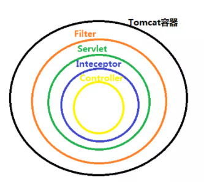

# Spring面试题

## Spring

### spring的主要核心

```java
- 控制反转(IOC)：将new对象的权利交给spring，我们从spring的IOC容器中获取
- 依赖注入(DI):在spring创建对象存在IOC容器时，告诉Spring要给bean的成员变量赋值
- 面向切面编程(AOP)：在不改变业务逻辑源码的基础上，对方法进行增强，例如：事务，权限    
```

### 三种注入属性的方式

```java
-set方法注入
    声明一个变量，并且提供set方法
    在配置文件中通过<property>标签在<bean>标签中引入
    	name:对应bean中的属性名，要求该属性必须提供可访问的set方法(严格规范为此名称是set方法对应名称)
            
-构造器注入
    在类中添加构造方法
    在applicationContext.xml中注入数据
            
-p命名空间注入
     引入p名称空间
     使用p名称空间注入数据     
```

### Spring由哪些模块组成？

```java
-spring core：提供了框架的基本组成部分，包括控制反转（IOC）和依赖注入（DI）功能
-spring beans：提供了BeanFactory，是工厂模式的一个经典实现，Spring将管理对象称为Bean
-spring context：构建于 core 封装包基础上的 context 封装包，提供了一种框架式的对象访问方法 -spring jdbc：提供了一个JDBC的抽象层，消除了烦琐的JDBC编码和数据库厂商特有的错误代码解析
-spring aop：提供了面向切面的编程实现，让你可以自定义拦截器、切点等
-spring Web：提供了针对 Web 开发的集成特性，例如文件上传
-spring test：主要为测试提供支持的，支持使用JUnit或TestNG对Spring组件进行单元测试和集成测试 
```

### Spring 框架中都用到了哪些设计模式

```java
- 工厂模式：BeanFactory就是简单工厂模式的体现，用来创建对象的实例
- 单例模式：Bean默认为单例模式
- 代理模式：Spring的AOP功能用到了JDK的动态代理和CGLIB字节码生成技术
- 模板方法：用来解决代码重复的问题。比如：RestTemplate, JmsTemplate, JpaTemplate
- 观察者模式：定义对象间一对多的依赖关系，当一个对象的状态发生改变时，所有依赖于它的对象都会得到通知被动更新，如Spring中listener的实现--ApplicationListener    
```

### BeanFactory 和 ApplicationContext有什么区别

```java
BeanFactory和ApplicationContext是Spring的两大核心接口，都可以当做Spring的容器。其中ApplicationContext是BeanFactory的子接口
    
区别：
    依赖关系：BeanFactory,是Spring里面最底层的接口,ApplicationContext接口实现BeanFactory接口，不但具有BeanFactory的所有功能，还提供了一下扩展
    
    加载方式：BeanFactroy采用的是延迟加载形式来注入Bean的，当我们用到某个bean的时候才实行加载，这样我们就不能发现spring的配置问题。ApplicationContext，它是在容器启动时，一次性创建了所有的Bean。这样，在容器启动时，我们就可以发现Spring中存在的配置错误，这样有利于检查所依赖属性是否注入。
    
    创建方式：BeanFactory通常以编程的方式被创建，ApplicationContext还能以声明的方式创建，如使用ContextLoader
    
    注册方式：BeanFactory和ApplicationContext都支持BeanPostProcessor、BeanFactoryPostProcessor的使用，但两者之间的区别是：BeanFactory需要手动注册，而ApplicationContext则是自动注册
```

### 什么是AOP

```java
AOP，一般称为面向切面，作为面向对象的一种补充，用于将那些与业务无关，但却对多个对象产生影响的公共行为和逻辑，抽取并封装为一个可重用的模块，这个模块被命名为“切面”（Aspect），减少系统中的重复代码，降低了模块间的耦合度，同时提高了系统的可维护性。可用于权限认证、日志、事务处理
    
-Target(目标对象):被代理的对象就是目标对象
-Proxy(代理对象):被增强后的对象就是代理对象
-JoinPoint(连接点):就是目标对象中所以被拦截到的方法
-PointCut(切入点):就是目标对象中被增强的方法
-Advice(通知):执行目标方法之前或者之后调用的方法就是通知
-Aspect(切面):通知方法和切入点方法结合所在的位置叫做切面
-Weaving(织入)：通知方法和切入点方法结合的过程，织入之后的结果就是切面
    
AOP的优点：
    提高代码的可重复性
    业务代码变成更加简洁
    业务代码维护更高效
    业务功能扩展更加便捷    
```

### Spring通知有哪些类型

在AOP术语中，切面的工作被称为通知，实际上是程序执行时要通过SpringAOP框架触发的代码段

| 通知类型                     | 说明                                                         | 使用场景                             |
| ---------------------------- | ------------------------------------------------------------ | ------------------------------------ |
| 前置通知（Before）           | 在目标方法被执行之前调用通知                                 |                                      |
| 后置通知（After）            | 无论如何都会在目标方法执行之后调用通知                       | 记录日志(方法已经调用，但不一定成功) |
| 返回通知（After-returning ） | 在目标方法正常返回后执行通知，如果方法没有正常返返回，例如抛出异常，则返回通知不会执行，可以通过配置得到目标方法的返回值 | 记录日志(方法已经成功调用)           |
| 异常通知（After-throwing）   | 在目标方法抛出异常后调用通知                                 | 异常处理                             |
| 环绕通知（Around）           | 通知包裹了目标方法，在目标方法调用之前和调用之后执行自定义的行为 | 事务权限控制                         |

### JDK动态代理和CGLIB动态代理的区别

- JDK动态代理只提供接口的代理，不支持类的代理。核心InvocationHandler接口和Proxy类，InvocationHandler 通过invoke()方法反射来调用目标类中的代码，动态地将横切逻辑和业务编织在一起；接着，Proxy利用 InvocationHandler动态创建一个符合某一接口的的实例,  生成目标类的代理对象。
- 如果代理类没有实现 InvocationHandler 接口，那么Spring AOP会选择使用CGLIB来动态代理目标类。CGLIB（Code Generation Library），是一个代码生成的类库，可以在运行时动态的生成指定类的一个子类对象，并覆盖其中特定方法并添加增强代码，从而实现AOP。CGLIB是通过继承的方式做的动态代理，因此如果某个类被标记为final，那么它是无法使用CGLIB做动态代理的。

> InvocationHandler 的 invoke(Object  proxy,Method  method,Object[] args)：proxy是最终生成的代理实例;  method 是被代理目标实例的某个具体方法;  args 是被代理目标实例某个方法的具体入参, 在方法反射调用时使用。

### Spring支持的几种bean的作用域

```java
singleton:bean在每一个spring ioc容器中只有一个实例
prototype：一个bean的定义可以有多个实例
request：每次http请求都会创建一个bean，该作用域只在web的 spring ApplicationContext情形下有效
session：在一个http session中，一个bean定义对应一个实例，该作用域只在web的 spring ApplicationContext情形下有效
global-session:同一个全局的HTTP Session中共享一个Bean，一般用于Portlet应用环境，该作用域仅在基于web的Spring ApplicationContext环境下有效    
    
配置方式：
    -xml配置方式
    -注解方式
```

> 缺省的Spring bean 的作用域是Singleton。使用 prototype 作用域需要慎重的思考，因为频繁创建和销毁 bean 会带来很大的性能开销

### Spring框架中的单例bean是线程安全的吗

```java
不是，Spring框架中的单例bean不是线程安全的,spring 中的 bean 默认是单例模式，spring 框架并没有对单例 bean 进行多线程的封装处理。
    
实际上大部分时候 spring bean 是无状态的（比如 dao 类），所以某种程度上来说 bean 也是安全的，但如果 bean 有状态的话（比如 view model 对象），那就要开发者自己去保证线程安全了，最简单的就是改变 bean 的作用域，把“singleton”变更为“prototype”，这样请求 bean 相当于 new Bean()了，所以就可以保证线程安全了
 
有状态和无状态区别:    
	有状态就是有数据存储功能
	无状态就是不会保存数据    
```

### Spring如何处理线程并发问题

```java
在一般情况下，只有无状态的Bean才可以在多线程环境下共享，在Spring中，绝大部分Bean都可以声明为singleton作用域，因为Spring对一些Bean中非线程安全状态采用ThreadLocal进行处理，解决线程安全问题。

ThreadLocal和线程同步机制都是为了解决多线程中共享变量的访问冲突问题。同步机制采用了“时间换空间”的方式，仅提供一份变量，不同的线程在访问前需要获取锁，没获得锁的线程则需要排队。而ThreadLocal采用了“空间换时间”的方式。

ThreadLocal会为每一个线程提供一个独立的变量副本，从而隔离了多个线程对数据的访问冲突。因为每一个线程都拥有自己的变量副本，从而也就没有必要对该变量进行同步了。ThreadLocal提供了线程安全的共享对象，在编写多线程代码时，可以把不安全的变量封装进ThreadLocal。
```

### @Autowired和@Resource之间的区别

@Autowired默认按类型装配（这个注解是属于spring的），@Resource 是JDK1.6支持的注解，默认按照名称进行装配

@Autowired默认情况下必须要求依赖对象必须存在，如果要允许null值，可以设置它的required属性为false，如：@Autowired(required=false) ，如果我们想使用名称装配可以结合@Qualifier注解进行使用

```java
@Autowired
@Qualifier("baseDao")
private BaseDao baseDao;
```

Resource名称可以通过name属性进行指定，如果没有指定name属性，当注解写在字段上时，默认取字段名，按照名称查找，如果注解写在setter方法上默认取属性名进行装配。当找不到与名称匹配的bean时才按照类型进行装配。但是需要注意的是，如果name属性一旦指定，就只会按照名称进行装配。

```java
@Resource(name="baseDao")
private BaseDao baseDao;
```

其实@Autowired + @Qualifier("BWM") == @Resource(name="BWM")，如果当一个接口只有一个实现类，使用@Autowired和@Resource没有区别，但是最好用@Autowired

### @Component, @Controller, @Service, @Repository有何区别

```java
@Controller用于标注控制层组件

@Service用于标注业务层组件

@Repository用于标注数据访问层组件，即DAO组件

@Component泛指组件，当组件不好归类的时候，我们可以使用这个注解进行标注
```

### spring支持的俩种类型的事务管理

```java
- 编程式事务管理：可以通过编程的方式管理事务，带来了极大的灵活性，可是难以维护
- 声明式事务管理：可以减业务代码和事务管理分离，只需要注解和xml配置来管理事务
```

### Spring的事务传播行为

- **PROPAGATION_REQUIRED**：如果当前没有事务，就创建一个新事务，如果当前存在事务，就加入该事务，该设置是最常用的设置。
- **PROPAGATION_SUPPORTS**：支持当前事务，如果当前存在事务，就加入该事务，如果当前不存在事务，就以非事务执行

- PROPAGATION_MANDATORY：支持当前事务，如果当前存在事务，就加入该事务，如果当前不存在事务，就抛出异常
- **PROPAGATION_REQUIRES_NEW**：创建新事务，无论当前存不存在事务，都创建新事务
- PROPAGATION_NOT_SUPPORTED：以非事务方式执行，如果当前存在事务，就把当前事务挂起
-  PROPAGATION_NEVER：以非事务方式执行，如果当前存在事务，则抛出异常
- PROPAGATION_NESTED：如果当前存在事务，则在嵌套事务内执行。如果当前没有事务，则按REQUIRED属性执行

### 说一下 spring 的事务隔离级别

spring 有五大隔离级别，默认值为 ISOLATION_DEFAULT（使用数据库的设置），其他四个隔离级别和数据库的隔离级别一致：

1. ISOLATION_DEFAULT：用底层数据库的设置隔离级别，数据库设置的是什么我就用什么；
2. ISOLATION_READ_UNCOMMITTED：读未提交，最低的隔离级别，一个事务可以读取另一个事务更新但未提交的数据。（会出现脏读、不可重复读、幻读）
3. ISOLATION_READ_COMMITTED：读已提交，一个事务提交后才能被其他事务读取到（会出现不可重复读、幻读），Oracle、SQL server 的默认级别
4. ISOLATION_REPEATABLE_READ：可重复读，对同一字段的多次读取结果都是一致的，除非数据被本身事务所修改（会出现幻读），MySQL 的默认级别
5. ISOLATION_SERIALIZABLE：可串行化，最高的隔离级别，可以防止脏读、不可重复读、幻读

## SpringMVC

### 什么是Spring MVC

```java
Spring MVC是一个基于Java，实现了MVC设计模式的请求驱动类型的轻量级Web框架，通过把模型-视图-控制器分离，将web层进行职责解耦，把复杂的web应用分成逻辑清晰的几部分，简化开发，减少出错，方便组内开发人员之间的配合
```

### Spring MVC的主要组件

- 前端控制器 DispatcherServlet：接收请求、响应结果，相当于转发器，有了DispatcherServlet 就减少了其它组件之间的耦合度
- 处理器映射器HandlerMapping：根据请求的URL来查找Handler
- 处理器适配器HandlerAdapter：在编写Handler的时候要按照HandlerAdapter要求的规则去编写，这样适配器HandlerAdapter才可以正确的去执行Handler
- 处理器Handler
- 视图解析器 ViewResolver：进行视图的解析，根据视图逻辑名解析成真正的视图
- 视图View：View是一个接口， 它的实现类支持不同的视图类型（jsp，freemarker，pdf等等）

### 请描述Spring MVC的工作流程

1. 用户发送请求至前端控制器DispatcherServlet
2. DispatcherServlet收到请求后，调用HandlerMapping处理器映射器，请求获取Handler
3. 处理器映射器根据请求url找到具体的处理器，生成处理器对象及处理器拦截器(如果有则生成)一并返回给DispatcherServlet
4. DispatcherServlet 调用 HandlerAdapter处理器适配器
5. HandlerAdapter 经过适配调用 具体处理器(Handler，也叫后端控制器)
6. Handler执行完成返回ModelAndView
7. HandlerAdapter将Handler执行结果ModelAndView返回给DispatcherServlet
8. DispatcherServlet将ModelAndView传给ViewResolver视图解析器进行解析
9. ViewResolver解析后返回具体View
10. DispatcherServlet对View进行渲染视图（即将模型数据填充至视图中）
11. DispatcherServlet响应用户

### MVC是什么

```java
mvc是一种设计模式。模型（model）-视图（view）-控制器（controller），三层架构的设计模式。用于实现前端页面的展现与后端业务数据处理的分离
```

### 拦截器Interceptor与过滤器Filter的区别

| 类型       | 过滤器Filter                                       | 拦截器Interceptor                                            |
| ---------- | -------------------------------------------------- | ------------------------------------------------------------ |
| 规范       | Filter是在Servlet规范中定义的，是Servlet容器支持的 | 拦截器是在Spring容器内的，是Spring框架支持的                 |
| 使用范围   | 过滤器只能用于Web程序中                            | 拦截器既可以用于Web程序，也可以用于Application、Swing程序中  |
| 原理       | 过滤器是基于函数回调                               | 拦截器是基于java的反射机制                                   |
| 使用的资源 | 过滤器不能使用Spring资源                           | 拦截器是一个Spring的组件，归Spring管理，配置在Spring文件中，因此能使用Spring里的任何资源、对象，例如Service对象、数据源、事务管理等，可以通过loC注入到拦截器 |
| 深度       | Filter在只在Servlet前后起作用                      | 拦截器能够深入到方法前后、异常抛出前后等，因此拦截器的使用具有更大的弹性 |

**在Tomcat容器中，过滤器和拦截器触发时机不一样**，过滤器是在请求进入容器后，但请求进入servlet之前进行预处理的。请求结束返回也是，是在servlet处理完后，返回给前端之前。过滤器包裹住servlet，servlet包裹住拦截器

